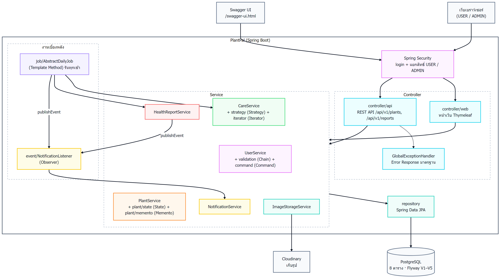

# PlantPal — Tree Management and Care Tracking System

PlantPal เป็นเว็บแอปสำหรับจัดการและติดตามการดูแลต้นไม้ ผู้ใช้เพิ่มต้นไม้ของตัวเองได้ และระบบจะสร้างตารางรดน้ำ ใส่ปุ๋ย และเปลี่ยนกระถางให้อัตโนมัติตามพันธุ์ไม้
ผู้ใช้กด "ทำแล้ว" เพื่อบันทึกการดูแล แล้วดูปฏิทินและประวัติได้ว่าดูแลตรงเวลาหรือไม่
เมื่อต้นไม้มีปัญหา ผู้ใช้ส่งรายงานสุขภาพพร้อมรูปให้ผู้ดูแลระบบตอบคำแนะนำ และระบบแจ้งเตือนงานที่ใกล้ถึงหรือเลยกำหนดทุกเช้า
ผู้ดูแลระบบจัดการพันธุ์ไม้ ผู้ใช้ และรายงานสุขภาพได้ และมี REST API สำหรับต้นไม้และรายงานพร้อมเอกสาร Swagger

## สมาชิกกลุ่ม

| ลำดับ | ชื่อ-นามสกุล | รหัสนักศึกษา | Section | Branch | หน้าที่รับผิดชอบ |
|---|---|---|---|---|---|
| 1 | นางสาวกมลพร เกตุแก้ว | 673380571-1 | 3 | `Kamolpon_6733805711_03` | รายงานสุขภาพต้นไม้, การแจ้งเตือน, งานตั้งเวลา (Observer, Template Method) |
| 2 | นางสาวพรีมภัทร ภาวัฒนวคุณ | 673380594-9 | 3 | `preemphat_6733805949_03` | สมัครสมาชิก / เข้าสู่ระบบ, จัดการผู้ใช้ (Command, Chain of Responsibility) |
| 3 | นางสาวมุกดา บุญประจันทร์ | 673380598-1 | 3 | `Mukda_6733805981_03` | จัดการต้นไม้, สถานะสุขภาพ, REST API (State, Memento) |
| 4 | นางสาวสรนันท์ บุสดี | 673380605-0 | 3 | `Soranan_6733806050_03` | ตารางการดูแล, ปฏิทิน, ประวัติการดูแล (Strategy, Iterator) |

## Presentation

- สไลด์นำเสนอ (PDF): [PlantPal_Slides.pdf](doc/slide/PlantPal_Slides.pdf)
- สไลด์นำเสนอ (Canva): [เปิดใน Canva](https://canva.link/sbs6wymgrya8tg3)
- รายงาน (PDF): [PlantPal_Report.pdf](doc/PlantPal_Report.pdf)

## Tech Stack

| ส่วน | เทคโนโลยี |
|---|---|
| ภาษา / Framework | Java 21, Spring Boot 4.1.1 (Web MVC, Data JPA, Security, Validation) |
| หน้าเว็บ | Thymeleaf, HTML, CSS, JavaScript |
| ฐานข้อมูล | PostgreSQL (Neon) + Flyway migration |
| เก็บรูปภาพ | Cloudinary |
| เอกสาร API | springdoc-openapi (Swagger UI) |
| ทดสอบ | JUnit 5, Mockito, AssertJ |
| Build / Deploy | Maven, Docker, GitHub Actions (CI/CD), Render |

## System Architecture

ระบบใช้ **Layered Architecture** แบบ MVC แบ่งเป็นชั้นที่เรียกต่อกันทางเดียว Controller ไม่เรียก Repository ตรง

```
ผู้ใช้ (Browser / REST client)
        │
Spring Security  ── ตรวจการเข้าสู่ระบบ และสิทธิ์ USER / ADMIN
        │
Controller        ── controller/web (หน้า Thymeleaf), controller/api (REST)
        │
Service           ── business logic + design patterns
        │
Repository        ── Spring Data JPA
        │
PostgreSQL (Neon)    Cloudinary (รูปภาพ)
```



**Design Patterns ที่ใช้**

| กลุ่ม | Pattern |
|---|---|
| Architectural | Layered Architecture, MVC, Repository, Service Layer, DTO + Mapper, Dependency Injection |
| GoF Behavioral | Strategy, State, Observer, Command, Chain of Responsibility, Memento, Iterator, Template Method |

**โครงสร้างโปรเจกต์**

```
Tree_Management_Final/
├── code/                      # โปรเจกต์ Spring Boot
│   ├── src/main/java/com/example/plantpal/
│   │   ├── controller/        # web (หน้า Thymeleaf) และ api (REST)
│   │   ├── service/           # business logic + service/strategy (Strategy)
│   │   ├── repository/        # Spring Data JPA
│   │   ├── domain/            # entity และ enum
│   │   ├── dto/, mapper/      # รับ-ส่งข้อมูลระหว่างชั้น
│   │   ├── event/             # Observer
│   │   ├── plant/state/       # State
│   │   ├── plant/memento/     # Memento
│   │   ├── command/           # Command
│   │   ├── validation/        # Chain of Responsibility
│   │   ├── iterator/          # Iterator
│   │   └── job/               # Template Method (งานตั้งเวลา)
│   ├── src/main/resources/    # templates, static, db/migration
│   ├── src/test/              # unit test
│   ├── Dockerfile
│   └── docker-compose.yml
├── doc/                       # เอกสารและ diagram
└── test/                      # Test Report
```

รายละเอียดเพิ่มเติม: [Component Diagram](doc/component-diagram.md) · [Design Patterns](doc/design-patterns.md) · [SOLID Analysis](doc/solid-analysis.md)

## Database Design (ER Diagram)


| ตาราง | เก็บอะไร |
|---|---|
| `users` | บัญชีผู้ใช้ อีเมล รหัสผ่าน (BCrypt) บทบาท และสถานะบัญชี |
| `user_profiles` | ชื่อ นามสกุล เบอร์โทร รูปโปรไฟล์ |
| `species` | พันธุ์ไม้และรอบการดูแล (รดน้ำ / ใส่ปุ๋ย / เปลี่ยนกระถาง) |
| `plants` | ต้นไม้ของผู้ใช้แต่ละคน และสถานะสุขภาพ |
| `care_schedules` | ตารางดูแลครั้งถัดไปของต้นไม้แต่ละต้น |
| `care_logs` | ประวัติการดูแลที่ทำไปแล้ว |
| `health_reports` | รายงานปัญหาสุขภาพต้นไม้และคำตอบจากผู้ดูแลระบบ |
| `notifications` | การแจ้งเตือนถึงผู้ใช้ |

Schema จัดการด้วย Flyway (`code/src/main/resources/db/migration`) รายละเอียดทุกคอลัมน์อยู่ที่ [Data Dictionary](doc/data-dictionary.md)

## Installation & Setup

**สิ่งที่ต้องมี**
- [Git](https://git-scm.com/)
- แบบ Docker: [Docker Desktop](https://www.docker.com/products/docker-desktop/)
- แบบ Maven: Java 21 (JDK) และ PostgreSQL (ไม่ต้องลง Maven เพราะใช้ `mvnw` ที่มากับโปรเจกต์)

**ขั้นตอน**
```bash
git clone https://github.com/lloganlrithm/Tree_Management_Final.git
cd Tree_Management_Final/code
cp .env.example .env
```

แก้ไฟล์ `.env` ถ้าต้องการอัปโหลดรูป (ไม่ใส่ก็เปิดแอปได้ แค่อัปโหลดรูปไม่ได้)
```
CLOUDINARY_URL=cloudinary://<api_key>:<api_secret>@<cloud_name>
```

ตาราง ข้อมูลพันธุ์ไม้ และข้อมูลตัวอย่าง Flyway จะสร้างให้เองตอนแอปเปิดครั้งแรก

## How to Run

### แบบที่ 1: Docker (แนะนำ)
```bash
cd code
docker compose up --build
```
ได้ทั้งแอปและ PostgreSQL ของตัวเอง เปิด http://localhost:8080

### แบบที่ 2: Maven
สร้างฐานข้อมูล `plantpal` ใน PostgreSQL ก่อน แล้วรัน
```powershell
cd code
$env:SPRING_DATASOURCE_URL="jdbc:postgresql://localhost:5432/plantpal"
$env:SPRING_DATASOURCE_USERNAME="postgres"
$env:SPRING_DATASOURCE_PASSWORD="postgres"
$env:CLOUDINARY_URL=""     # ใส่ค่าจริงถ้าต้องการอัปโหลดรูป
.\mvnw spring-boot:run
```
(macOS / Linux ใช้ `export ชื่อ=ค่า` และ `./mvnw spring-boot:run`) แล้วเปิด http://localhost:8080

## API Documentation

เอกสาร API แบบลองเรียกได้จริง (Swagger UI)
- บนเว็บ: https://plantpal-owy8.onrender.com/swagger-ui.html
- ในเครื่อง: http://localhost:8080/swagger-ui.html
- OpenAPI JSON: `/v3/api-docs`

API ใช้ session เดียวกับหน้าเว็บ ให้เข้าสู่ระบบที่ `/login` ในเบราว์เซอร์เดียวกันก่อน แล้วค่อยเรียก API ผ่าน Swagger UI

| Method | Endpoint | คำอธิบาย |
|---|---|---|
| GET | `/api/v1/plants` | รายการต้นไม้ของฉัน (แบ่งหน้า) |
| GET | `/api/v1/plants/{id}` | ดูต้นไม้ 1 ต้น (ของคนอื่น = 404) |
| POST | `/api/v1/plants` | เพิ่มต้นไม้ → 201 Created |
| PUT | `/api/v1/plants/{id}` | แก้ไขต้นไม้ |
| DELETE | `/api/v1/plants/{id}` | ลบต้นไม้ → 204 No Content |
| GET | `/api/v1/reports` | รายการรายงานสุขภาพ กรองตามสถานะได้ (USER เห็นของตัวเอง, ADMIN เห็นทั้งหมด) |
| GET | `/api/v1/reports/{id}` | ดูรายงาน 1 รายการ |
| POST | `/api/v1/reports` | ส่งรายงานสุขภาพ → 201 Created (แนบรูปผ่าน API ไม่ได้) |
| PATCH | `/api/v1/reports/{id}/reply` | ตอบรายงาน (เฉพาะ ADMIN ไม่ใช่ = 403) |
| DELETE | `/api/v1/reports/{id}` | ลบรายงานของตัวเอง → 204 No Content |

## How to Run Tests

```powershell
cd code
.\mvnw test
```
(macOS / Linux ใช้ `./mvnw test`)

- ผลล่าสุด: **111 test case ผ่านทั้งหมด** (Failures 0, Errors 0)
- `PlantpalApplicationTests` ต้องต่อฐานข้อมูลจริง (ตั้งค่า `SPRING_DATASOURCE_*` เหมือนตอนรัน) ส่วนเทสต์อื่นใช้ Mockito จำลอง Repository
- รันเฉพาะบางคลาส: `.\mvnw test "-Dtest=CareServiceImplTest"`
- GitHub Actions รันเทสต์ทุกครั้งที่ push หรือเปิด PR เข้า `develop` / `main`
- รายละเอียด Test Case ทั้งหมดอยู่ที่ [Test Report](test/TEST_REPORT.md)

## Deployment URL

🌐 **https://plantpal-owy8.onrender.com**

- Deploy ด้วย Docker บน Render ฐานข้อมูลอยู่ที่ Neon (PostgreSQL)
- push เข้า `develop` แล้วเทสต์ผ่าน GitHub Actions จะสั่ง Render deploy ใหม่อัตโนมัติ
- Render free tier หลับเมื่อไม่มีคนใช้ เปิดครั้งแรกอาจช้าเกือบ 1 นาที
- รายละเอียด: [Deployment Diagram](doc/deployment-diagram.md)

## เอกสารเพิ่มเติม

| เอกสาร | ไฟล์ |
|---|---|
| Use Case Diagram และคำอธิบาย | [doc/use-case.md](doc/use-case.md) |
| Activity Diagram | [doc/activity-diagram.md](doc/activity-diagram.md) |
| Sequence Diagrams | [doc/sequence-diagrams.md](doc/sequence-diagrams.md) |
| Domain Model | [doc/domain-model.md](doc/domain-model.md) |
| ER Diagram และ Data Dictionary | [doc/data-dictionary.md](doc/data-dictionary.md) |
| Component Diagram | [doc/component-diagram.md](doc/component-diagram.md) |
| Deployment Diagram | [doc/deployment-diagram.md](doc/deployment-diagram.md) |
| Design Patterns | [doc/design-patterns.md](doc/design-patterns.md) |
| SOLID Analysis | [doc/solid-analysis.md](doc/solid-analysis.md) |
| Test Report | [test/TEST_REPORT.md](test/TEST_REPORT.md) |
