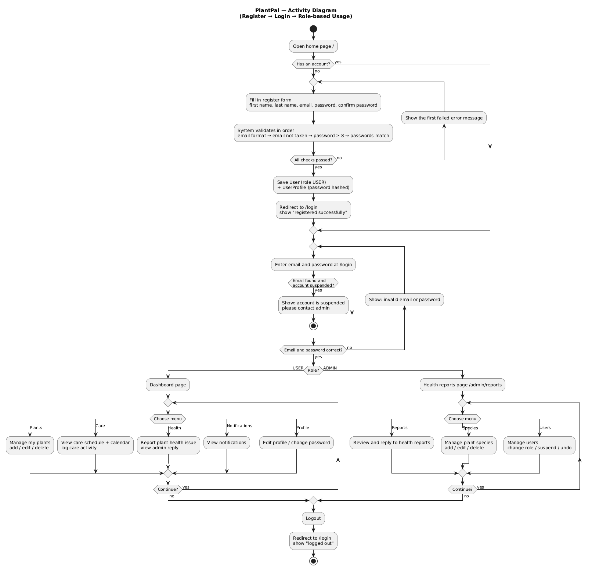

# Activity Diagram — PlantPal

ลำดับการใช้งานตั้งแต่สมัครสมาชิก → เข้าสู่ระบบ → ใช้งานตามบทบาท (USER / ADMIN)

## ขั้นตอนหลัก

| ขั้นตอน | สิ่งที่เกิดขึ้น | อ้างอิงในโค้ด |
|---|---|---|
| สมัครสมาชิก | ตรวจข้อมูลทีละขั้น ไม่ผ่านข้อไหนแสดง error ข้อนั้นแล้วให้กรอกใหม่ ผ่านครบจึงบันทึก User (role USER) + UserProfile | `AuthWebController`, `UserServiceImpl`, `validation/` |
| เข้าสู่ระบบ | Spring Security ตรวจอีเมลและรหัสผ่าน ผิดให้กรอกใหม่ | `SecurityConfig`, `CustomUserDetailsService` |
| บัญชีถูกระงับ | ถ้า `isActive = false` เข้าสู่ระบบไม่ได้ แสดงว่าบัญชีถูกระงับ | `CustomUserDetailsService`, `SecurityConfig` |
| แยกตามบทบาท | USER ไปหน้า Dashboard / ADMIN ไปหน้ารายงานสุขภาพ | `RoleBasedLoginSuccessHandler` |
| ใช้งาน (USER) | จัดการต้นไม้, ดูแลต้นไม้ + ปฏิทิน, แจ้งปัญหาสุขภาพ, ดูแจ้งเตือน, แก้โปรไฟล์ | `controller/web/` |
| ใช้งาน (ADMIN) | ตอบรายงานสุขภาพ, จัดการพันธุ์ไม้, จัดการผู้ใช้ (เปลี่ยน role / ระงับ / ย้อนกลับ) | `controller/web/Admin*Controller` |
| ออกจากระบบ | กลับไปหน้า login | `SecurityConfig` |