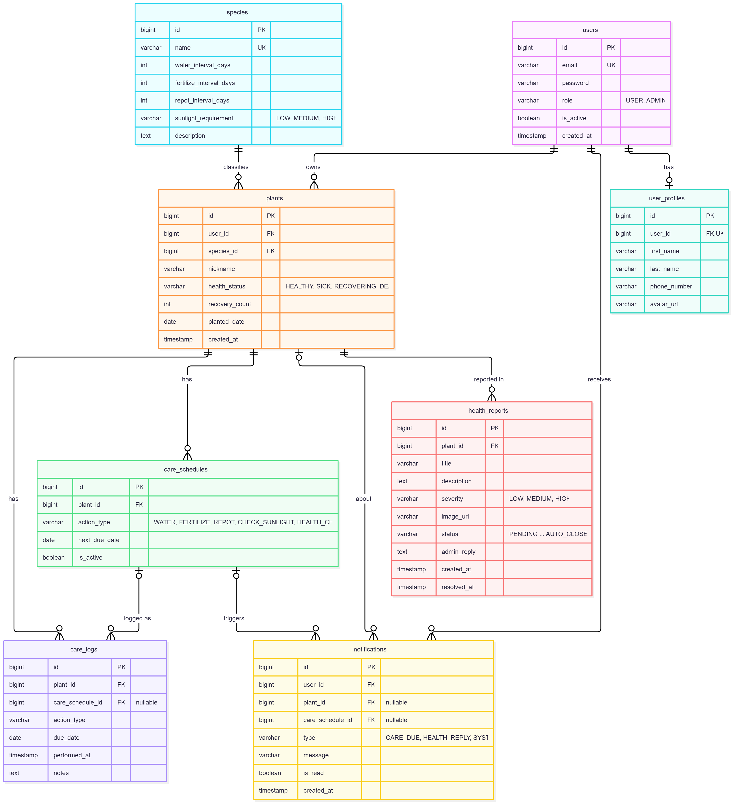

# Data Dictionary — PlantPal

ฐานข้อมูล PostgreSQL (Neon) จัดการ schema ด้วย Flyway (`code/src/main/resources/db/migration`)

## ER Diagram

## สรุปตาราง

| ตาราง | คำอธิบาย | ความสัมพันธ์ |
|---|---|---|
| `users` | บัญชีผู้ใช้สำหรับเข้าสู่ระบบ | 1:0..1 `user_profiles`, 1:N `plants`, 1:N `notifications` |
| `user_profiles` | ข้อมูลส่วนตัวของผู้ใช้ | 1:1 กับ `users` |
| `species` | สายพันธุ์ต้นไม้และรอบการดูแล | 1:N `plants` |
| `plants` | ต้นไม้ของผู้ใช้แต่ละคน | N:1 `users`, N:1 `species` |
| `care_schedules` | ตารางนัดดูแลต้นไม้ครั้งถัดไป | N:1 `plants` |
| `care_logs` | ประวัติการดูแลที่ทำไปแล้ว | N:1 `plants`, N:0..1 `care_schedules` |
| `health_reports` | รายงานปัญหาสุขภาพต้นไม้ที่ส่งให้แอดมิน | N:1 `plants` |
| `notifications` | การแจ้งเตือนถึงผู้ใช้ | N:1 `users`, N:0..1 `plants`, N:0..1 `care_schedules` |

คำย่อ: **PK** = Primary Key, **FK** = Foreign Key, **UK** = Unique

---

## 1. `users`

| คอลัมน์ | ชนิดข้อมูล | Null | Key | ค่าเริ่มต้น | คำอธิบาย |
|---|---|---|---|---|---|
| `id` | BIGINT (identity) | ไม่ได้ | PK | auto | รหัสผู้ใช้ |
| `email` | VARCHAR(255) | ไม่ได้ | UK | | อีเมลสำหรับเข้าสู่ระบบ |
| `password` | VARCHAR(255) | ไม่ได้ | | | รหัสผ่านที่เข้ารหัสแล้ว (BCrypt) |
| `role` | VARCHAR(20) | ไม่ได้ | | `'USER'` | สิทธิ์: `USER`, `ADMIN` |
| `is_active` | BOOLEAN | ไม่ได้ | | `TRUE` | บัญชียังใช้งานได้หรือไม่ |
| `created_at` | TIMESTAMP | ไม่ได้ | | `NOW()` | วันเวลาที่สมัคร |

## 2. `user_profiles`

| คอลัมน์ | ชนิดข้อมูล | Null | Key | ค่าเริ่มต้น | คำอธิบาย |
|---|---|---|---|---|---|
| `id` | BIGINT (identity) | ไม่ได้ | PK | auto | รหัสโปรไฟล์ |
| `user_id` | BIGINT | ไม่ได้ | FK, UK | | อ้างถึง `users.id` (ลบ user แล้วลบตาม: CASCADE) |
| `first_name` | VARCHAR(100) | ได้ | | | ชื่อ |
| `last_name` | VARCHAR(100) | ได้ | | | นามสกุล |
| `phone_number` | VARCHAR(20) | ได้ | | | เบอร์โทร |
| `avatar_url` | VARCHAR(500) | ได้ | | | ลิงก์รูปโปรไฟล์ |

## 3. `species`

| คอลัมน์ | ชนิดข้อมูล | Null | Key | ค่าเริ่มต้น | คำอธิบาย |
|---|---|---|---|---|---|
| `id` | BIGINT (identity) | ไม่ได้ | PK | auto | รหัสสายพันธุ์ |
| `name` | VARCHAR(100) | ไม่ได้ | UK | | ชื่อสายพันธุ์ |
| `water_interval_days` | INTEGER | ไม่ได้ | | | รดน้ำทุกกี่วัน (ต้อง > 0) |
| `fertilize_interval_days` | INTEGER | ได้ | | | ใส่ปุ๋ยทุกกี่วัน (> 0, NULL = ใช้ค่าตั้งต้นใน Strategy) — เพิ่มใน V2 |
| `repot_interval_days` | INTEGER | ได้ | | | เปลี่ยนกระถางทุกกี่วัน (> 0, NULL = ใช้ค่าตั้งต้นใน Strategy) — เพิ่มใน V2 |
| `sunlight_requirement` | VARCHAR(20) | ได้ | | | แสงที่ต้องการ: `LOW`, `MEDIUM`, `HIGH` |
| `description` | TEXT | ได้ | | | คำอธิบายสายพันธุ์ |

## 4. `plants`

| คอลัมน์ | ชนิดข้อมูล | Null | Key | ค่าเริ่มต้น | คำอธิบาย |
|---|---|---|---|---|---|
| `id` | BIGINT (identity) | ไม่ได้ | PK | auto | รหัสต้นไม้ |
| `user_id` | BIGINT | ไม่ได้ | FK | | เจ้าของ → `users.id` (CASCADE) |
| `species_id` | BIGINT | ไม่ได้ | FK | | สายพันธุ์ → `species.id` (RESTRICT: ลบสายพันธุ์ที่มีต้นไม้ใช้อยู่ไม่ได้) |
| `nickname` | VARCHAR(100) | ได้ | | | ชื่อเล่นต้นไม้ |
| `health_status` | VARCHAR(20) | ไม่ได้ | | `'HEALTHY'` | สถานะ: `HEALTHY`, `SICK`, `RECOVERING`, `DEAD` (เปลี่ยนผ่าน State pattern) |
| `recovery_count` | INTEGER | ไม่ได้ | | `0` | จำนวนครั้งที่ฟื้นจากป่วยสำเร็จ |
| `planted_date` | DATE | ได้ | | | วันที่ปลูก |
| `created_at` | TIMESTAMP | ไม่ได้ | | `NOW()` | วันเวลาที่เพิ่มเข้าระบบ |

Index: `idx_plants_user_id (user_id)`, `idx_plants_species_id (species_id)`

## 5. `care_schedules`

| คอลัมน์ | ชนิดข้อมูล | Null | Key | ค่าเริ่มต้น | คำอธิบาย |
|---|---|---|---|---|---|
| `id` | BIGINT (identity) | ไม่ได้ | PK | auto | รหัสตารางนัด |
| `plant_id` | BIGINT | ไม่ได้ | FK | | ต้นไม้ → `plants.id` (CASCADE) |
| `action_type` | VARCHAR(20) | ไม่ได้ | | | ประเภท: `WATER`, `FERTILIZE`, `REPOT`, `CHECK_SUNLIGHT`, `HEALTH_CHECK` |
| `next_due_date` | DATE | ไม่ได้ | | | วันที่ต้องดูแลครั้งถัดไป |
| `is_active` | BOOLEAN | ไม่ได้ | | `TRUE` | ยังใช้งานตารางนี้อยู่หรือไม่ |

Constraint: `UNIQUE (plant_id, action_type)` — 

ต้นหนึ่งมีนัดแต่ละประเภทได้แค่ 1 แถว
Index: `idx_care_schedules_due (is_active, next_due_date)`

## 6. `care_logs`

| คอลัมน์ | ชนิดข้อมูล | Null | Key | ค่าเริ่มต้น | คำอธิบาย |
|---|---|---|---|---|---|
| `id` | BIGINT (identity) | ไม่ได้ | PK | auto | รหัสบันทึก |
| `plant_id` | BIGINT | ไม่ได้ | FK | | ต้นไม้ → `plants.id` (CASCADE) |
| `care_schedule_id` | BIGINT | ได้ | FK | | ตารางนัดที่มาจาก → `care_schedules.id` (SET NULL) |
| `action_type` | VARCHAR(20) | ไม่ได้ | | | ประเภทการดูแล (ค่าเดียวกับ `care_schedules`) |
| `due_date` | DATE | ได้ | | | วันที่ครบกำหนดของรอบนั้น |
| `performed_at` | TIMESTAMP | ไม่ได้ | | `NOW()` | วันเวลาที่ทำจริง |
| `notes` | TEXT | ได้ | | | หมายเหตุ |

Index: `idx_care_logs_plant_performed (plant_id, performed_at DESC)`

## 7. `health_reports`

| คอลัมน์ | ชนิดข้อมูล | Null | Key | ค่าเริ่มต้น | คำอธิบาย |
|---|---|---|---|---|---|
| `id` | BIGINT (identity) | ไม่ได้ | PK | auto | รหัสรายงาน |
| `plant_id` | BIGINT | ไม่ได้ | FK | | ต้นไม้ → `plants.id` (CASCADE) |
| `title` | VARCHAR(150) | ไม่ได้ | | | หัวข้อรายงาน |
| `description` | TEXT | ได้ | | | รายละเอียดอาการ |
| `severity` | VARCHAR(10) | ได้ | | | ความรุนแรง: `LOW`, `MEDIUM`, `HIGH` |
| `image_url` | VARCHAR(500) | ได้ | | | ลิงก์รูปอาการ |
| `status` | VARCHAR(20) | ไม่ได้ | | `'PENDING'` | สถานะ: `PENDING`, `IN_PROGRESS`, `RESOLVED`, `REJECTED`, `FOLLOWED_UP`, `AUTO_CLOSED` (2 ค่าหลังเพิ่มใน V4) |
| `admin_reply` | TEXT | ได้ | | | คำตอบจากแอดมิน |
| `created_at` | TIMESTAMP | ไม่ได้ | | `NOW()` | วันเวลาที่ส่งรายงาน |
| `resolved_at` | TIMESTAMP | ได้ | | | วันเวลาที่รายงานจบ |

Index: `idx_health_reports_plant (plant_id, created_at DESC)`, `idx_health_reports_status (status)`

## 8. `notifications`

| คอลัมน์ | ชนิดข้อมูล | Null | Key | ค่าเริ่มต้น | คำอธิบาย |
|---|---|---|---|---|---|
| `id` | BIGINT (identity) | ไม่ได้ | PK | auto | รหัสการแจ้งเตือน |
| `user_id` | BIGINT | ไม่ได้ | FK | | ผู้รับ → `users.id` (CASCADE) |
| `plant_id` | BIGINT | ได้ | FK | | ต้นไม้ที่เกี่ยวข้อง → `plants.id` (CASCADE) |
| `care_schedule_id` | BIGINT | ได้ | FK | | ตารางนัดที่เกี่ยวข้อง → `care_schedules.id` (SET NULL) |
| `type` | VARCHAR(20) | ไม่ได้ | | | ประเภท: `CARE_DUE`, `HEALTH_REPLY`, `SYSTEM` |
| `message` | VARCHAR(255) | ไม่ได้ | | | ข้อความแจ้งเตือน |
| `is_read` | BOOLEAN | ไม่ได้ | | `FALSE` | อ่านแล้วหรือยัง |
| `created_at` | TIMESTAMP | ไม่ได้ | | `NOW()` | วันเวลาที่สร้าง |

Index: `idx_notifications_user_read (user_id, is_read)`

---

## ประวัติ Migration

| ไฟล์ | สิ่งที่ทำ |
|---|---|
| `V1__create_tables.sql` | สร้างตารางทั้ง 8 ตาราง |
| `V2__add_care_intervals_to_species.sql` | เพิ่ม `fertilize_interval_days`, `repot_interval_days` ใน `species` |
| `V3__seed_test_users.sql` | เพิ่มผู้ใช้ทดสอบ |
| `V4__add_report_outcome_statuses.sql` | เพิ่มสถานะ `FOLLOWED_UP`, `AUTO_CLOSED` ใน `health_reports` |
| `V5__seed_demo_data.sql` | เพิ่มข้อมูลตัวอย่าง (สายพันธุ์ ต้นไม้ ตารางนัด บันทึก รายงาน) |