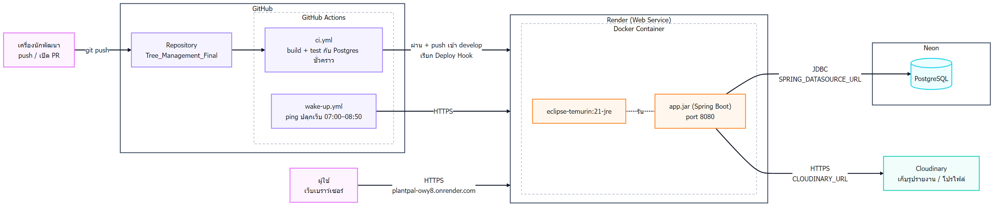

# Deployment Diagram — PlantPal

ระบบรันอยู่ที่ไหนบ้าง และโค้ดเดินทางจากเครื่องนักพัฒนาไปถึงเว็บจริงยังไง

URL: https://plantpal-owy8.onrender.com

## ส่วนประกอบ

| ส่วน | สิ่งที่อยู่ข้างใน | อ้างอิง |
|---|---|---|
| GitHub Repository | โค้ดทั้งหมด branch `develop` คือ branch ที่ deploy | `Tree_Management_Final` |
| GitHub Actions: CI | build + รัน test ทุก push / PR กับ PostgreSQL ชั่วคราว (ไม่แตะ Neon) เก็บรายงาน test ไว้ในหน้า Actions | `.github/workflows/ci.yml` |
| GitHub Actions: ปลุกเว็บ | ping เว็บทุก 10 นาที ช่วง 07:00–08:50 ให้ job แจ้งเตือนตอน 08:00 ได้ทำงาน | `.github/workflows/wake-up.yml` |
| Render (Web Service) | รัน Docker container ของแอป | `code/Dockerfile` |
| Docker Container | `app.jar` (Spring Boot) บน JRE 21 พอร์ต 8080 ไม่รันด้วย root | `code/Dockerfile` |
| Neon | PostgreSQL บนคลาวด์ Flyway สร้างตารางตอนแอปเริ่ม | `resources/db/migration/` |
| Cloudinary | เก็บไฟล์รูป | `CLOUDINARY_URL` |

## ขั้นตอน deploy

| ขั้นตอน | สิ่งที่เกิดขึ้น | อ้างอิง |
|---|---|---|
| push / เปิด PR | GitHub Actions เริ่ม build และรัน test ทั้งหมด | `ci.yml` |
| test ไม่ผ่าน | หยุด ไม่ deploy | `ci.yml` |
| test ผ่าน + push เข้า `develop` | เรียก Render Deploy Hook (เก็บใน GitHub Secrets) ส่วน PR ไม่ deploy | `RENDER_DEPLOY_HOOK` |
| Render build | สร้าง Docker image 2 ขั้น: build jar ด้วย Maven แล้วเหลือแค่ JRE + jar | `code/Dockerfile` |
| แอปเริ่มทำงาน | อ่านค่าลับจาก environment variable ต่อ Neon และ Cloudinary | `SPRING_DATASOURCE_URL`, `SPRING_DATASOURCE_USERNAME`, `SPRING_DATASOURCE_PASSWORD`, `CLOUDINARY_URL` |
| ผู้ใช้เข้าเว็บ | เข้าผ่าน HTTPS ที่ Render | `plantpal-owy8.onrender.com` |

## รันในเครื่อง

`code/docker-compose.yml` รันแอปคู่กับ PostgreSQL ในเครื่อง ไม่ต้องต่อ Neon

## หมายเหตุ

- ไม่มีรหัส DB หรือ key ใน repo ทุกค่าส่งเป็น environment variable
- Render free tier หลับเมื่อไม่มีคนใช้ เปิดครั้งแรกหลังหลับช้าเกือบนาที
