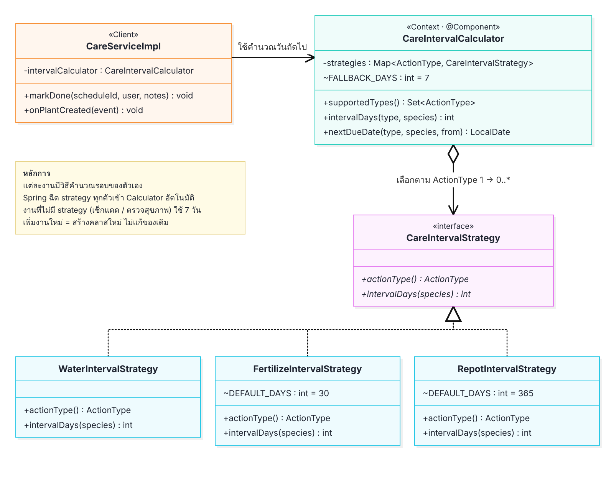
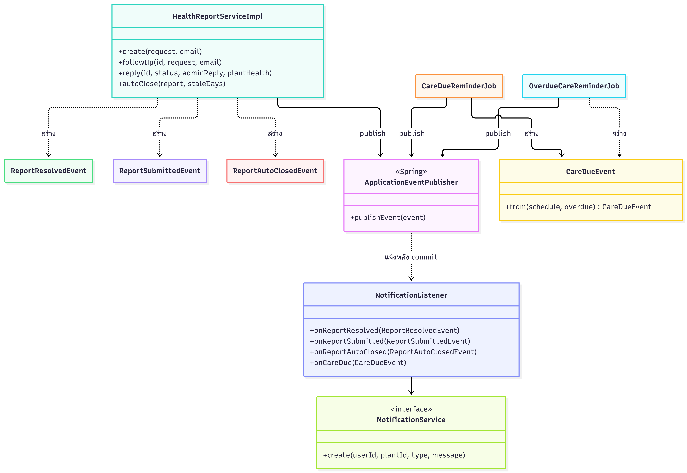
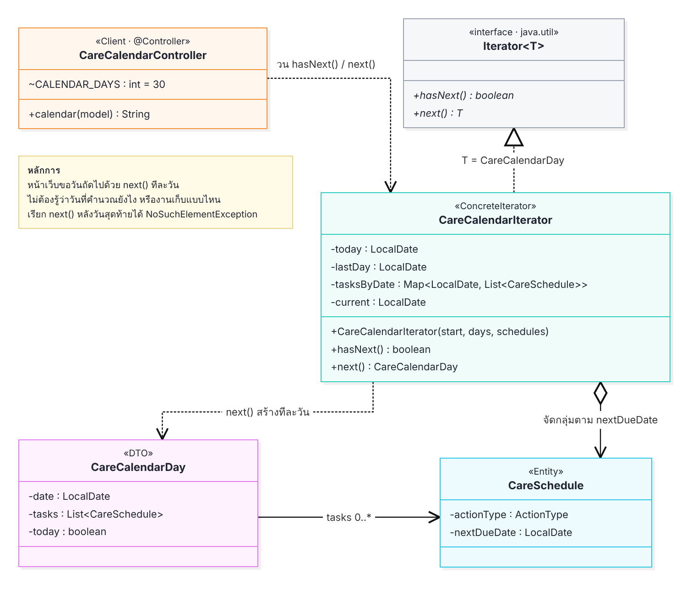
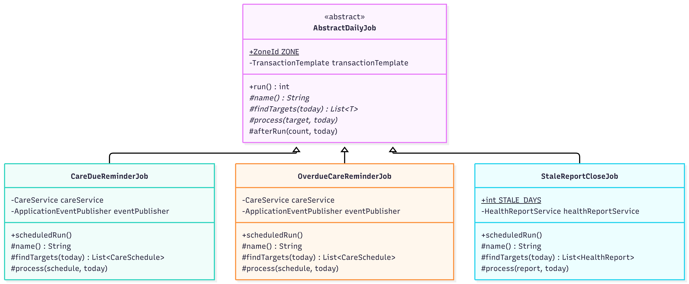

# Design Patterns — PlantPal

## สรุปภาพรวม

| Pattern | กลุ่ม | ปัญหาที่แก้ | ไฟล์/คลาสที่ใช้ | ผู้รับผิดชอบ |
|---|---|---|---|---|
| Layered Architecture | Architectural |  | `controller/` → `service/` → `repository/` → `domain/` |  |
| MVC | Architectural |  | `controller/web/` + `templates/` |  |
| Repository | Architectural |  | `repository/` |  |
| Service Layer | Architectural |  | `service/`, `service/impl/` |  |
| DTO + Mapper | Architectural |  | `dto/request/`, `dto/response/`, `mapper/` |  |
| Dependency Injection | Architectural |  | Constructor Injection ทุก service/controller |  |
| Strategy | GoF Behavioral | งานดูแลแต่ละประเภทคำนวณรอบวันไม่เหมือนกัน ถ้าเขียน if-else ใน service เพิ่มงานใหม่ต้องแก้ service ทุกครั้ง | `service/strategy/` | Soranan |
| State |
| Observer | GoF Behavioral | งานหลักหลายจุด (ตอบรายงาน, ส่งรายงาน, job รายวัน) ต้องสร้างแจ้งเตือน ถ้าเรียก NotificationService ตรงๆ ทุกโมดูลจะผูกกับระบบแจ้งเตือน | `event/` | Kamolpon |
| Command | GoF Behavioral | แอดมินเปลี่ยน role / ระงับบัญชีผิดคน แล้วย้อนกลับไม่ได้ | `command/` | Preemphat |
| Chain of Responsibility | GoF Behavioral | การตรวจข้อมูลสมัครสมาชิกกองรวมเป็น if-else ยาวใน service | `validation/` | Preemphat |
| Memento | GoF Behavioral | ผู้ใช้แก้ข้อมูลต้นไม้ผิดแล้วกดบันทึกไป ค่าเดิมหาย ต้องจำแล้วแก้กลับเอง | `plant/memento/` | Mukda |
| Iterator | GoF Behavioral | ปฏิทิน 30 วันต้องแสดงทุกวันแม้วันที่ไม่มีงาน แต่ข้อมูลที่ได้มาเป็นรายการตารางดูแล ไม่ใช่รายวัน | `iterator/` | Soranan |
| Template Method | GoF Behavioral | job รายวัน 3 ตัวมีขั้นตอนเหมือนกัน (เปิด transaction, หาวันที่, วนทำ, เขียน log) ต่างกันแค่หาอะไร / ทำอะไร | `job/` | Kamolpon |

---

## 1. Enterprise / Architectural Patterns (บังคับทุกกลุ่ม)

### 1.1 Layered Architecture
- **ปัญหาที่แก้:** _(รอใส่)_
- **ไฟล์/คลาสที่ใช้:** `controller/` → `service/` → `repository/` → `domain/` (ห้าม controller เรียก repository ตรง)
- **เหตุผลที่เลือก:** _(รอใส่)_

### 1.2 MVC
- **ปัญหาที่แก้:** _(รอใส่)_
- **ไฟล์/คลาสที่ใช้:** Controller = `controller/web/*Controller`, View = `resources/templates/`, Model = DTO ที่ส่งเข้า `Model`
- **เหตุผลที่เลือก:** _(รอใส่)_

### 1.3 Repository
- **ปัญหาที่แก้:** _(รอใส่)_
- **ไฟล์/คลาสที่ใช้:** `repository/*Repository` (Spring Data JPA)
- **เหตุผลที่เลือก:** _(รอใส่)_

### 1.4 Service Layer
- **ปัญหาที่แก้:** _(รอใส่)_
- **ไฟล์/คลาสที่ใช้:** interface ใน `service/` + implementation ใน `service/impl/`
- **เหตุผลที่เลือก:** _(รอใส่)_

### 1.5 DTO + Mapper
- **ปัญหาที่แก้:** _(รอใส่)_
- **ไฟล์/คลาสที่ใช้:** `dto/request/`, `dto/response/`, `mapper/PlantMapper`, `mapper/HealthReportMapper`
- **เหตุผลที่เลือก:** _(รอใส่)_

### 1.6 Dependency Injection
- **ปัญหาที่แก้:** _(รอใส่)_
- **ไฟล์/คลาสที่ใช้:** Constructor Injection (`@RequiredArgsConstructor` + field `final`) ทุก service/controller
- **เหตุผลที่เลือก:** _(รอใส่)_

---

## 2. GoF Patterns — กลุ่ม Behavioral

### 2.1 Strategy
- **ผู้รับผิดชอบ:** Soranan
- **ปัญหาที่แก้:**
  - งานดูแลแต่ละประเภทมีรอบไม่เท่ากัน: รดน้ำใช้รอบของพันธุ์ไม้เสมอ, ใส่ปุ๋ยกับเปลี่ยนกระถางใช้รอบของพันธุ์ถ้า admin กรอกไว้ ถ้าไม่ได้กรอกใช้ค่าตั้งต้น 30 วัน / 365 วัน
  - ต้องคำนวณวันครบกำหนด 2 จังหวะ: ตอนเพิ่มต้นไม้ใหม่ (สร้างตารางดูแล) และตอนผู้ใช้กด "ทำแล้ว" (เลื่อนไปครั้งถัดไป)
  - ถ้าเขียน `switch` / if-else ไว้ใน `CareServiceImpl` กติกาการคำนวณจะปนกับโค้ดบันทึกข้อมูล และเพิ่มงานประเภทใหม่ทีไรต้องกลับมาแก้ service ทุกครั้ง
- **ไฟล์/คลาสที่ใช้:**
  - `service/strategy/CareIntervalStrategy` (interface: `actionType()`, `intervalDays(species)`)
  - `service/strategy/WaterIntervalStrategy`, `FertilizeIntervalStrategy`, `RepotIntervalStrategy` (strategy ของแต่ละงาน)
  - `service/strategy/CareIntervalCalculator` (Context: เลือก strategy ตาม `ActionType`)
  - `service/impl/CareServiceImpl` (ผู้เรียกใช้: `markDone`, `onPlantCreated`)
- **เหตุผลที่เลือก:**
  - แต่ละคลาสรู้กติกาของงานตัวเองแค่อย่างเดียว `CareServiceImpl` เรียกแค่ `intervalCalculator.nextDueDate(type, species, today)` ไม่ต้องรู้ว่าแต่ละงานคำนวณยังไง
  - Spring ส่ง strategy ทุกตัวที่เป็น `@Component` เข้า constructor ของ `CareIntervalCalculator` ให้เอง แล้วเก็บไว้ใน `EnumMap` ตาม `ActionType` จะเพิ่มงานใหม่ แค่สร้างคลาส strategy ใหม่ ไม่ต้องแก้ Calculator หรือ service (Open/Closed)
  - งานที่ยังไม่มี strategy ของตัวเอง (เช็กแดด / ตรวจสุขภาพ) ใช้รอบสำรอง 7 วัน ระบบเลยไม่พังถ้าเจอประเภทงานที่ยังไม่รองรับ
  - `supportedTypes()` บอกว่างานไหนมี strategy ซึ่งใช้ตัดสินด้วยว่าจะสร้างตารางอัตโนมัติให้งานไหนตอนเพิ่มต้นไม้ (ตอนนี้คือ WATER, FERTILIZE, REPOT) เพิ่ม strategy ใหม่ ตารางของงานนั้นจะถูกสร้างให้เอง
  - ทดสอบแต่ละกติกาแยกกันได้ (`CareIntervalStrategyTest`, `CareIntervalCalculatorTest`, `CareServiceImplTest`)
- **Class Diagram:**

### 2.2 State

- **ผู้รับผิดชอบ:** Mukda
- **ปัญหาที่แก้:**
  - ต้นไม้มี 4 สถานะ แต่เปลี่ยนไปหากันได้ไม่ครบทุกทาง เช่น DEAD เปลี่ยนไปสถานะอื่นไม่ได้อีก และ HEALTHY กระโดดไป RECOVERING ไม่ได้
  - ถ้าเขียน if-else ใน `PlantServiceImpl` กติกาจะกระจายอยู่หลายที่ ทั้งปุ่มในหน้าต้นไม้และตอนแอดมินตอบรายงาน
  - `recovery_count` ต้องเพิ่มเฉพาะตอนที่ต้นไม้ฟื้นจริงเท่านั้น
- **ไฟล์/คลาส:**
  - `plant/state/PlantHealthState`, `HealthyState`, `SickState`, `RecoveringState`, `DeadState`, `PlantHealthStates`, `InvalidHealthTransitionException`
  - `service/impl/PlantServiceImpl` (`changeHealth`, `changeMyPlantHealth`, `markSick`, `markRecovering`)
  - `controller/web/PlantController` (`POST /plants/{id}/health`)
- **เหตุผล:**
  - แต่ละสถานะตัดสินเองผ่าน `canChangeTo` / `onLeave` ส่วน service เรียกแค่บรรทัดเดียวคือ `PlantHealthStates.of(current).changeTo(plant, target)`
  - กติกาอยู่ที่เดียว ถ้าเปลี่ยนสถานะผิดจะ throw `InvalidHealthTransitionException` และ API ตอบ 409
  - `nextOf()` ทำให้หน้าเว็บแสดงเฉพาะปุ่มที่กดได้จริง
  - เป็นไปตาม Open/Closed: ถ้าจะเพิ่มสถานะใหม่ ก็แค่สร้างคลาสใหม่แล้วลงทะเบียนใน `PlantHealthStates`
  - ใช้ instance ร่วมกันเก็บไว้ใน `EnumMap`
  - มีเทสต์ใน `PlantHealthStateTest` และ `PlantServiceImplHealthTest`
- **State Diagram:**

- **Class Diagram:**

### 2.3 Observer
- **ผู้รับผิดชอบ:** Kamolpon
- **ปัญหาที่แก้:**
  - หลายเหตุการณ์ในระบบต้องแจ้งเตือนคนอื่น เช่น admin ตอบรายงาน → แจ้งเจ้าของต้นไม้, ผู้ใช้ส่งรายงาน → แจ้ง admin ทุกคน, งานดูแลถึงกำหนด → แจ้งเจ้าของ
  - ถ้าให้ `HealthReportServiceImpl` หรือ job เรียก `NotificationService` ตรงๆ ทุกโมดูลจะต้องรู้จักระบบแจ้งเตือน แก้ข้อความหรือเพิ่มช่องทางแจ้งเตือนทีไรต้องไล่แก้หลายไฟล์
  - ถ้าบันทึกรายงานพังแต่แจ้งเตือนถูกสร้างไปแล้ว ผู้ใช้จะได้แจ้งเตือนของสิ่งที่ไม่ได้เกิดขึ้นจริง
- **ไฟล์/คลาสที่ใช้:**
  - Event: `event/ReportResolvedEvent`, `ReportSubmittedEvent`, `ReportAutoClosedEvent`, `CareDueEvent`, `PlantCreatedEvent`
  - Listener: `event/NotificationListener` (`onReportResolved`, `onReportSubmitted`, `onReportAutoClosed`, `onCareDue`), `service/impl/CareServiceImpl.onPlantCreated`
  - ผู้ส่ง event (เรียก `publishEvent`):
    - `service/impl/HealthReportServiceImpl` → ตอบรายงาน, ส่งรายงาน / ติดตามผล, ปิดรายงานอัตโนมัติ
    - `job/CareDueReminderJob`, `job/OverdueCareReminderJob` → งานดูแลพรุ่งนี้ / เลยกำหนด
    - `service/impl/PlantServiceImpl` → เพิ่มต้นไม้ใหม่ (`CareServiceImpl` รับไปสร้างตารางดูแล)
- **เหตุผลที่เลือก:**
  - ผู้ส่งแค่ประกาศว่า "เกิดอะไรขึ้น" ผ่าน `ApplicationEventPublisher` ของ Spring ไม่ต้องรู้ว่าใครฟังอยู่ ระบบรายงานกับระบบแจ้งเตือนเลยแยกกันได้
  - จะเพิ่มแจ้งเตือนแบบใหม่ แค่สร้าง event + เพิ่ม method ใน listener ไม่ต้องแก้ของเดิม (ตอนแรกมีผู้ฟังตัวเดียว ตอนนี้เพิ่มเป็น 4 โดยไม่แตะตัวแรก)
  - ใช้ `@TransactionalEventListener` (ทำงานหลัง commit) แจ้งเตือนจะถูกสร้างก็ต่อเมื่อบันทึกข้อมูลหลักสำเร็จแล้วเท่านั้น และใช้ `REQUIRES_NEW` เปิด transaction ใหม่ให้บันทึกแจ้งเตือนได้
  - event เก็บแค่ค่าที่ต้องใช้ (id, ชื่อ, สถานะ) ไม่ส่ง entity เพราะ listener ทำงานหลัง transaction เดิมปิดไปแล้ว
  - เขียน unit test แยกได้ (`NotificationListenerTest`, `HealthReportServiceImplTest` เช็กว่าส่ง event จริง)
- **Class Diagram:**

### 2.4 Command
- **ผู้รับผิดชอบ:** Preem
- **ปัญหาที่แก้:** 
  - หน้าจัดการผู้ใช้ แอดมินเปลี่ยน role หรือกดระงับบัญชีได้ทันทีด้วยคลิกเดียว ถ้ากดผิดคนต้องไปหาเองว่าเดิมเป็นค่าอะไรแล้วแก้กลับเอง
  - ถ้าเขียนแบบปกติ service แก้ค่าแล้ว save เลย จะไม่มีที่เก็บค่าเดิมไว้ย้อนกลับ
- **ไฟล์/คลาสที่ใช้:**
  - `command/UserCommand` (interface)
  - `command/ChangeRoleCommand`
  - `command/SetActiveCommand`
  - `command/UserCommandInvoker`
  - `service/impl/AdminUserServiceImpl`
- **เหตุผลที่เลือก:** 
  - เราเปลี่ยน การกระทำ ให้เป็น object แต่ละคำสั่งเลยจำได้เองว่าก่อนทำค่าเป็นอะไร พอกดย้อนก็แค่เรียก `undo()` ค่าก็กลับมาเหมือนเดิม
  - Invoker ใช้ `@SessionScope` แอดมินแต่ละคนมีประวัติของตัวเอง ไม่ปนกัน
  - จะเพิ่มคำสั่งใหม่ เช่น รีเซ็ตรหัสผ่าน แค่สร้างคลาสใหม่ที่ implements `UserCommand` ไม่ต้องแก้ invoker หรือคำสั่งเดิม 
- **Class Diagram:**
- 

### 2.5 Chain of Responsibility
- **ผู้รับผิดชอบ:** Preemphat
- **ปัญหาที่แก้:** 
  - ตอนสมัครสมาชิกต้องตรวจหลายเรื่อง รูปแบบอีเมล, อีเมลซ้ำ, ความยาวรหัสผ่าน, รหัสผ่านตรงกัน
  - ถ้าเขียนรวมใน `UserServiceImpl.register()` จะเป็น if-else ยาว service ทำหลายหน้าที่ ผิด SRP และเพิ่มเงื่อนไขใหม่ทีไรต้องแก้ service ทุกครั้ง
- **ไฟล์/คลาสที่ใช้:**
  - `validation/RegisterValidator` (abstract class มี `next` ชี้ไปตัวถัดไป)
  - `validation/EmailFormatValidator`, `EmailNotTakenValidator`, `PasswordLengthValidator`, `PasswordMatchValidator`
  - `validation/RegisterValidationChain`
  - `service/impl/UserServiceImpl`
- **เหตุผลที่เลือก:** 
  - แต่ละ validator ตรวจแค่เรื่องเดียว ไม่ผ่านก็โยน `RegistrationException` แล้ว chain หยุดทันที ผู้ใช้เห็น error ทีละข้อตามลำดับ
  - เรียงจากเช็คง่ายไปยาก รูปแบบอีเมลก่อน ค่อยไปถาม DB ว่าซ้ำไหม ถ้าอีเมลผิดรูปแบบก็ไม่ต้องเสียเวลาถาม DB
  - จะเพิ่มหรือสลับลำดับการตรวจ แก้ที่ `RegisterValidationChain` ที่เดียว ไม่ต้องแตะ `UserServiceImpl`
  - เขียน unit test แยกแต่ละตัวได้ (`RegisterValidationChainTest`)
- **Class Diagram:**

### 2.6 Memento

- **ผู้รับผิดชอบ:** Mukda
- **ปัญหาที่แก้:** ผู้ใช้แก้ข้อมูลต้นไม้ผิดแล้วกดบันทึกไป ค่าเดิมหาย ต้องจำแล้วแก้กลับเอง ถ้าจะเก็บประวัติไว้ใน entity หรือ service ตรง ๆ โค้ดจะรก
- **ไฟล์/คลาส:**
  - Memento: `plant/memento/PlantSnapshot` (record)
  - Caretaker: `plant/memento/PlantEditHistory` (`@SessionScope`)
  - Originator: `service/impl/PlantServiceImpl` (`createSnapshot`, `restoreSnapshot`, `update`, `undoLastEdit`, `canUndo`)
  - `controller/web/PlantController` (`POST /plants/{id}/undo`)
- **เหตุผล:**
  - ก่อน `update` จะถ่าย snapshot ของค่าเดิมเก็บไว้ก่อนทุกครั้ง
  - `PlantSnapshot` เป็น record จึงแก้ค่าข้างในไม่ได้ (immutable)
  - Caretaker แค่เก็บและคืน snapshot โดยไม่เข้าไปดูข้างใน
  - เป็น session scope ผู้ใช้แต่ละคนจึงมีประวัติของตัวเอง และไม่ต้องสร้างตารางใน DB
  - ไม่เก็บ `healthStatus` ใน snapshot เพราะการเปลี่ยนสถานะต้องผ่าน State pattern เท่านั้น
  - undo ได้ครั้งเดียว เพราะ `take()` ดึง snapshot ออกไปแล้ว
  - มีเทสต์ใน `PlantServiceImplUndoTest`
- **Class Diagram:**

### 2.7 Iterator
- **ผู้รับผิดชอบ:** Soranan
- **ปัญหาที่แก้:**
  - หน้าปฏิทินการดูแลต้องแสดงครบ 30 วันข้างหน้า รวมถึงวันที่ไม่มีงานด้วย และต้องรู้ว่าวันไหนคือ "วันนี้"
  - ข้อมูลที่ได้จาก `CareService.findDueBetween()` เป็นรายการตารางดูแลเรียงตามวันครบกำหนด ไม่ได้มาเป็นรายวัน
  - ถ้าให้ controller หรือหน้า Thymeleaf วนวันที่แล้วกรองงานของแต่ละวันเอง โค้ดคำนวณวันที่จะไปอยู่ในหน้า HTML และต้องวนรายการงานทั้งหมดซ้ำทุกวัน
- **ไฟล์/คลาสที่ใช้:**
  - `iterator/CareCalendarIterator` (implements `java.util.Iterator<CareCalendarDay>`)
  - `dto/response/CareCalendarDay` (ข้อมูล 1 วัน: วันที่, งานของวันนั้น, เป็นวันนี้หรือไม่)
  - `controller/web/CareCalendarController` (ผู้เรียกใช้: วน `hasNext()` / `next()` แล้วส่งรายการวันให้ `care/calendar.html`)
- **เหตุผลที่เลือก:**
  - ใช้ interface `Iterator` มาตรฐานของ Java ผู้เรียกแค่วน `hasNext()` / `next()` ได้ "วัน" ทีละวันตามลำดับ ไม่ต้องรู้ว่าข้างในคำนวณวันที่หรือเก็บงานไว้ยังไง
  - จัดกลุ่มงานตามวันครบกำหนดลง `Map` ครั้งเดียวตอนสร้าง แล้ว `next()` แค่หยิบงานของวันนั้นออกมา ไม่ต้องวนงานทั้งหมดทุกวัน
  - หน้า HTML ไม่ต้องคำนวณวันที่เอง แค่วนแสดง `days` ตามลำดับ และใช้ค่า `today` ไฮไลต์วันนี้
  - ป้องกันการใช้งานผิด: สร้างด้วยจำนวนวันน้อยกว่า 1 จะ throw `IllegalArgumentException` และเรียก `next()` เกินวันสุดท้ายจะ throw `NoSuchElementException` ตามสัญญาของ `Iterator`
  - จะเปลี่ยนช่วงปฏิทิน (เช่น 7 วัน หรือ 60 วัน) แค่เปลี่ยนตัวเลขที่ส่งเข้าไป ไม่ต้องแก้ตัว iterator
  - มีเทสต์ใน `CareCalendarIteratorTest`
- **Class Diagram:**

### 2.8 Template Method
- **ผู้รับผิดชอบ:** Kamolpon
- **ปัญหาที่แก้:**
  - ระบบมีงานที่ต้องรันเองทุกเช้า 3 งาน: เตือนงานดูแลพรุ่งนี้ (08:00), เตือนงานที่เลยกำหนด (08:05), ปิดรายงานที่ไม่มีการบอกผลเกิน 14 วัน (08:10)
  - ทั้ง 3 งานมีขั้นตอนเหมือนกันหมด: หาวันที่วันนี้ (เวลาไทย) → เปิด transaction → หาว่าต้องทำกับอะไร → ทำทีละรายการ → เขียน log สรุป
  - ถ้าเขียนแยก 3 คลาส โค้ดส่วนที่เหมือนกันจะก๊อปซ้ำ 3 ที่ ถ้าแก้ (เช่น เปลี่ยน timezone) ต้องแก้ 3 ที่และลืมได้ง่าย
- **ไฟล์/คลาสที่ใช้:**
  - `job/AbstractDailyJob<T>` (abstract class มี template method `run()` เป็น `final`)
  - `job/CareDueReminderJob`, `job/OverdueCareReminderJob`, `job/StaleReportCloseJob` (คลาสลูก)
  - `config/SchedulingConfig` (เปิดใช้ `@Scheduled`)
- **เหตุผลที่เลือก:**
  - คลาสแม่กำหนดลำดับขั้นตอนไว้ใน `run()` ที่เป็น `final` คลาสลูก override ไม่ได้ ทุก job ทำงานลำดับเดียวกันแน่นอน
  - คลาสลูกเขียนแค่ส่วนที่ต่าง: `findTargets()` (หาอะไร) กับ `process()` (ทำอะไร) ส่วน `afterRun()` เป็น hook จะเขียนทับหรือไม่ก็ได้
  - ส่วนที่เหมือนกันอยู่ที่เดียว: ใช้เวลาไทย `Asia/Bangkok` เสมอแม้ server บน Render เป็น UTC, ทั้งงานอยู่ใน transaction เดียวเลยอ่านข้อมูล LAZY ได้
  - เพิ่ม job ใหม่แค่ extends `AbstractDailyJob` แล้วเขียน 3 method (ตอนแรกมี 2 job ทีหลังเพิ่ม `StaleReportCloseJob` โดยไม่ต้องแก้คลาสแม่)
  - job ไม่เรียก repository ตรง เรียกผ่าน `CareService` / `HealthReportService` และส่งแจ้งเตือนผ่าน Observer (`CareDueEvent`)
  - เขียน unit test เรียก `run()` ตรงๆ ได้โดยไม่ต้องรอเวลา (`CareReminderJobsTest`, `StaleReportCloseJobTest`)
- **Class Diagram:**

> `run()` เป็น `final` (template method) ลำดับตายตัว: 1) `findTargets` → 2) `process` ทีละรายการ → 3) `afterRun` (hook) · ตัวเอียง = abstract ที่คลาสลูกต้องเขียน
