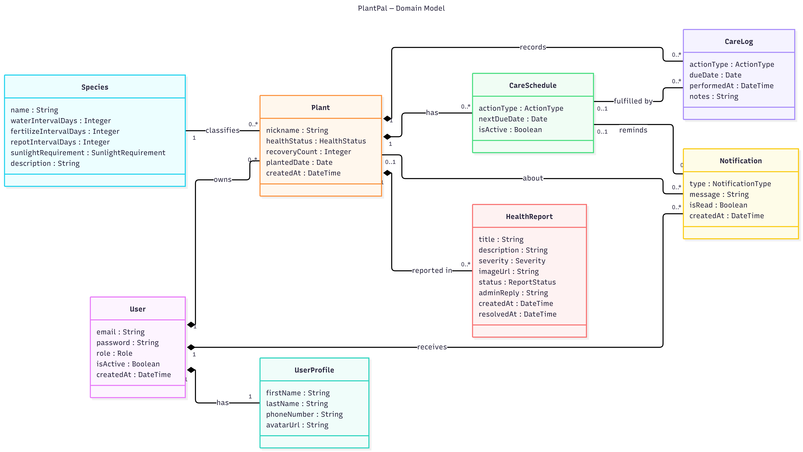
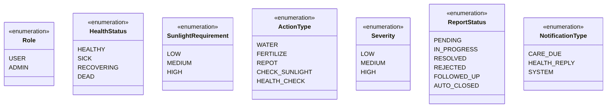
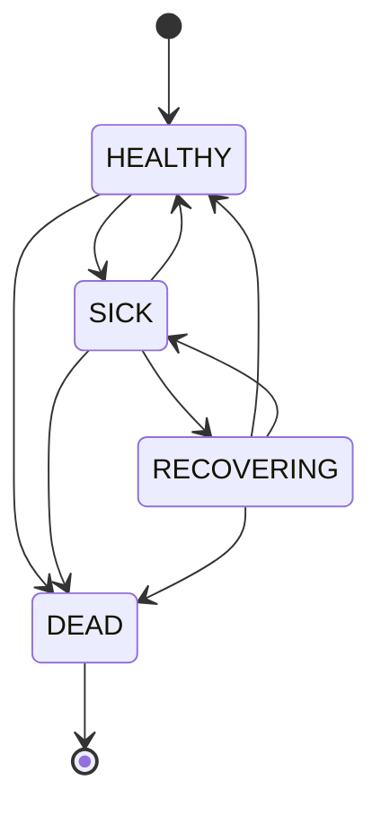

# Domain Model (Conceptual Class Diagram) — PlantPal

แผนภาพนี้แสดงแนวคิดของระบบ คือมีอะไรบ้าง แต่ละอย่างเก็บข้อมูลอะไร และเกี่ยวกันยังไง
เลยไม่ใส่ id, foreign key, method หรือคลาสของโค้ด (Controller / Service) ดูรายละเอียดจริงได้ใน `code/src/main/java/com/example/plantpal/domain/`

## แผนภาพ

## Conceptual Classes

| Class | ความหมาย | Attributes |
|---|---|---|
| User | บัญชีผู้ใช้สำหรับ login | email, password, role, isActive, createdAt |
| UserProfile | ข้อมูลส่วนตัวของผู้ใช้ | firstName, lastName, phoneNumber, avatarUrl |
| Species | สายพันธุ์ต้นไม้ และค่าแนะนำการดูแล | name, waterIntervalDays, fertilizeIntervalDays, repotIntervalDays, sunlightRequirement, description |
| Plant | ต้นไม้ของผู้ใช้แต่ละต้น | nickname, healthStatus, recoveryCount, plantedDate, createdAt |
| CareSchedule | ตารางดูแลที่ต้องทำครั้งถัดไป | actionType, nextDueDate, isActive |
| CareLog | ประวัติว่าดูแลอะไรไปแล้ว | actionType, dueDate, performedAt, notes |
| HealthReport | รายงานปัญหาสุขภาพที่ผู้ใช้แจ้ง และแอดมินตอบ | title, description, severity, imageUrl, status, adminReply, createdAt, resolvedAt |
| Notification | แจ้งเตือนถึงผู้ใช้ | type, message, isRead, createdAt |

## Enumerations

| Enum | ใช้ใน | ค่าที่เป็นไปได้ |
|---|---|---|
| Role | User.role | USER, ADMIN |
| HealthStatus | Plant.healthStatus | HEALTHY, SICK, RECOVERING, DEAD |
| SunlightRequirement | Species.sunlightRequirement | LOW, MEDIUM, HIGH |
| ActionType | CareSchedule.actionType, CareLog.actionType | WATER, FERTILIZE, REPOT, CHECK_SUNLIGHT, HEALTH_CHECK |
| Severity | HealthReport.severity | LOW, MEDIUM, HIGH |
| ReportStatus | HealthReport.status | PENDING, IN_PROGRESS, RESOLVED, REJECTED, FOLLOWED_UP, AUTO_CLOSED |
| NotificationType | Notification.type | CARE_DUE, HEALTH_REPLY, SYSTEM |

## ความสัมพันธ์

| ความสัมพันธ์ | ชื่อเส้น | Multiplicity | ชนิด | ความหมาย |
|---|---|---|---|---|
| User — UserProfile | has | 1 — 1 | One-to-One | ผู้ใช้ 1 คนมีโปรไฟล์ 1 อัน (แยกข้อมูลส่วนตัวออกจากข้อมูล login) |
| User — Plant | owns | 1 — 0..* | One-to-Many | ผู้ใช้ 1 คนมีต้นไม้ได้หลายต้น ลบผู้ใช้แล้วต้นไม้หายตาม |
| User — Notification | receives | 1 — 0..* | One-to-Many | ผู้ใช้ 1 คนได้รับแจ้งเตือนหลายอัน |
| Species — Plant | classifies | 1 — 0..* | One-to-Many | 1 สายพันธุ์ใช้กับต้นไม้ได้หลายต้น ลบสายพันธุ์ที่ยังมีต้นไม้ใช้อยู่ไม่ได้ |
| Plant — CareSchedule | has | 1 — 0..* | One-to-Many | ต้นไม้ 1 ต้นมีตารางดูแลหลายอย่าง เช่น รดน้ำ ใส่ปุ๋ย (งานชนิดเดียวกันซ้ำไม่ได้) |
| Plant — CareLog | records | 1 — 0..* | One-to-Many | เก็บประวัติว่าดูแลอะไรไปแล้วบ้าง |
| Plant — HealthReport | reported in | 1 — 0..* | One-to-Many | ผู้ใช้แจ้งปัญหาสุขภาพต้นไม้ แอดมินตอบกลับ |
| CareSchedule — CareLog | fulfilled by | 0..1 — 0..* | One-to-Many  | บันทึกการดูแลอาจทำตามตาราง หรือทำเองนอกตารางก็ได้ |
| Plant — Notification | about | 0..1 — 0..* | One-to-Many  | แจ้งเตือนอาจผูกกับต้นไม้ หรือเป็นแจ้งเตือนระบบเฉยๆ |
| CareSchedule — Notification | reminds | 0..1 — 0..* | One-to-Many  | แจ้งเตือนงานดูแลที่ใกล้ถึงหรือเลยกำหนด |

**สัญลักษณ์ในแผนภาพ**

| เส้น | ความหมาย | 
|---|---|
| เส้นทึบมีรูปเพชร ◆ | Composition — ตัวแม่ถูกลบ ตัวลูกถูกลบไปด้วย (ตรงกับ `cascade = ALL, orphanRemoval = true` ในโค้ด) |
| เส้นทึบธรรมดา | Association — เกี่ยวข้องกัน แต่ลบตัวหนึ่งแล้วอีกตัวไม่หายตาม |

## สถานะสุขภาพต้นไม้ (State)

`Plant.healthStatus` เปลี่ยนได้ตามกฎใน `plant/state/` เท่านั้น (State Pattern)

| สถานะปัจจุบัน | เปลี่ยนเป็นได้ |
|---|---|
| HEALTHY | SICK, DEAD |
| SICK | RECOVERING, HEALTHY, DEAD |
| RECOVERING | HEALTHY, SICK, DEAD |
| DEAD | (เปลี่ยนไม่ได้อีก) |