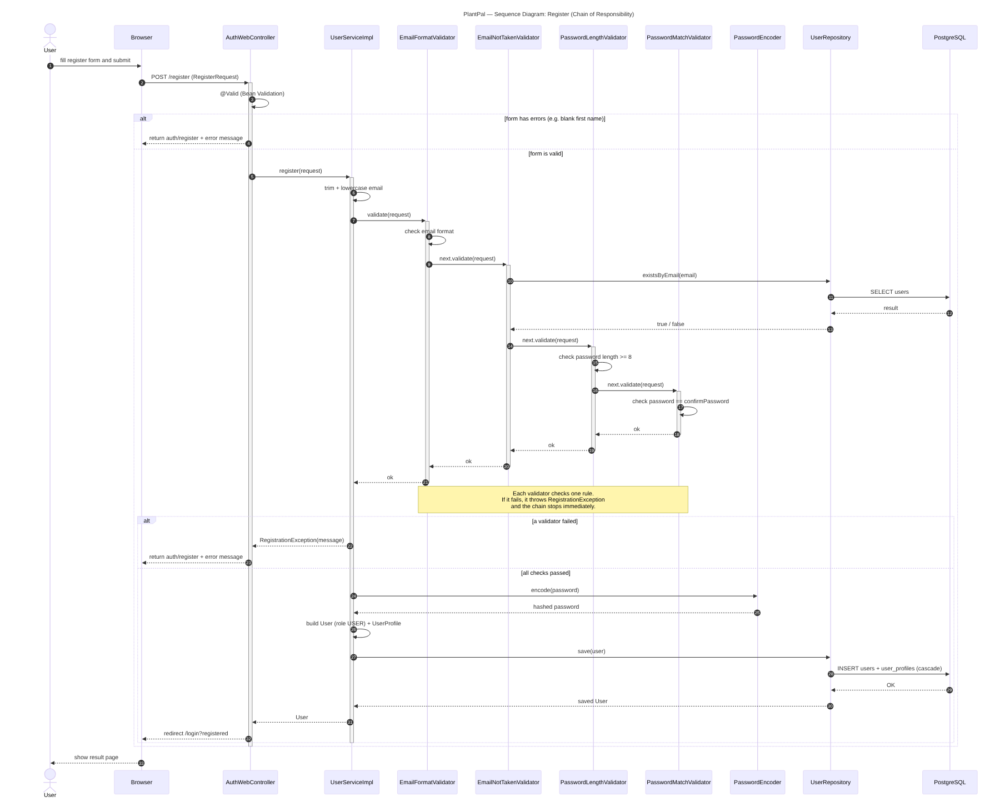
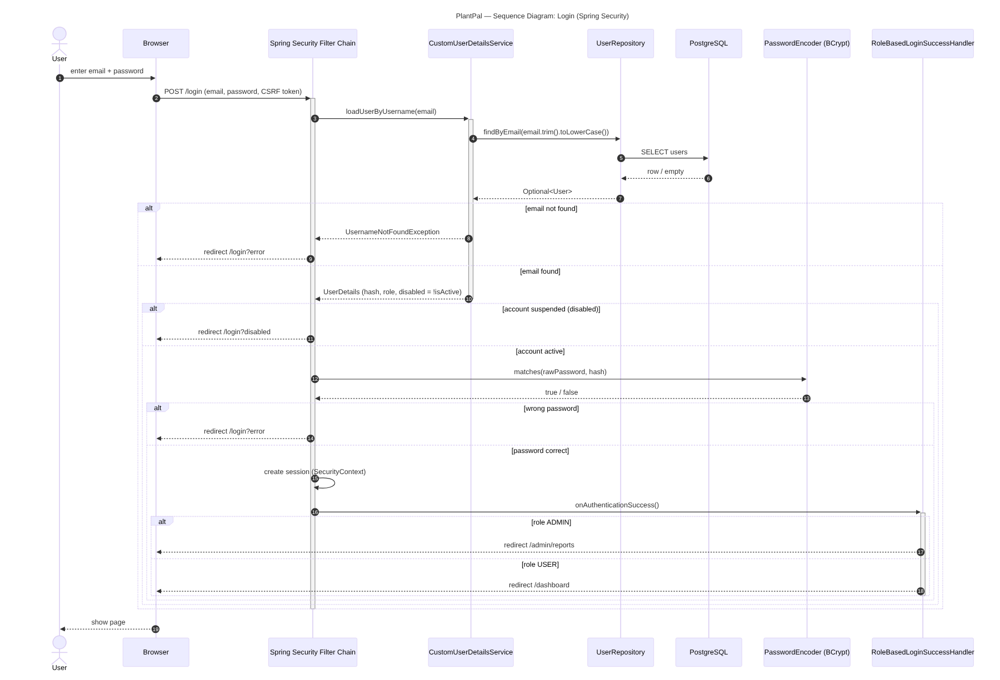
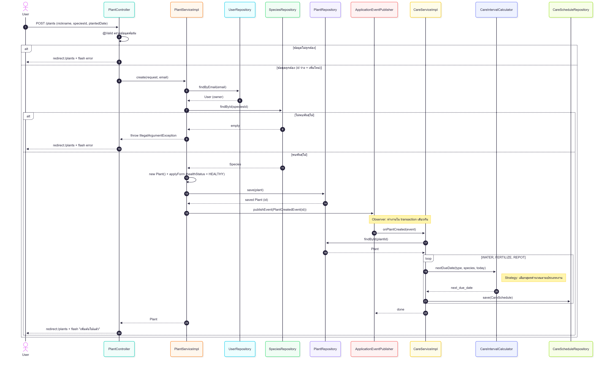
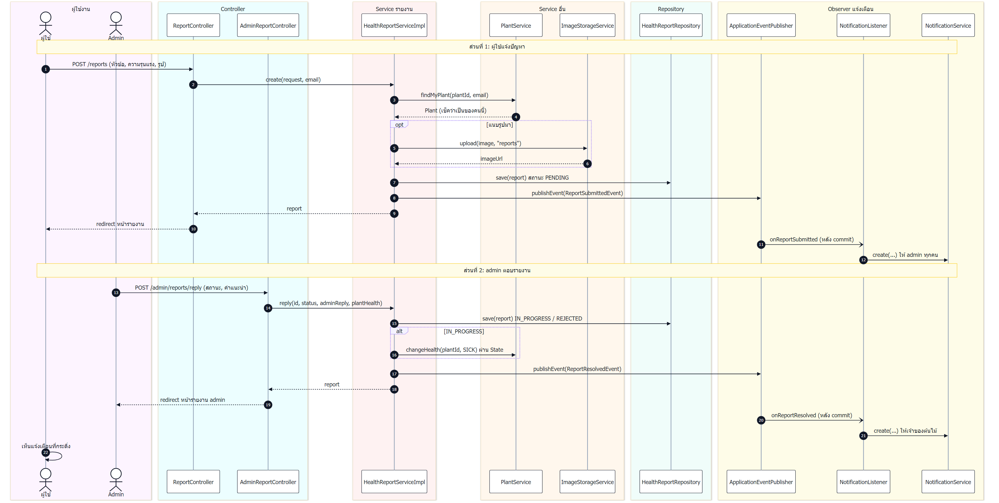
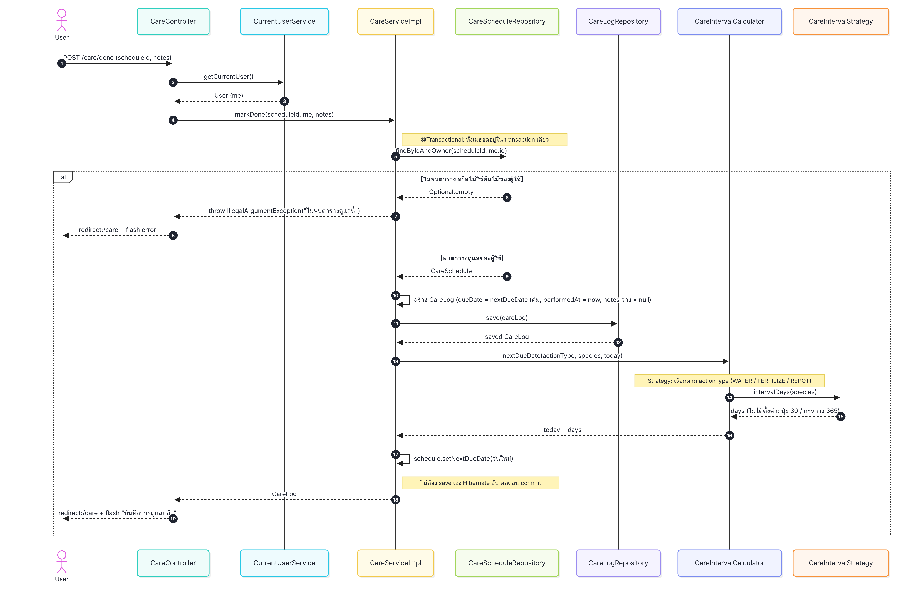

# Sequence Diagrams — PlantPal

แสดงลำดับการเรียกกันระหว่าง class ในแต่ละ scenario หลักของระบบ

| # | Scenario | ผู้รับผิดชอบ | Pattern ที่เห็น |
|---|---|---|---|
| 1 | สมัครสมาชิก | Preemphat | Chain of Responsibility |
| 2 | เข้าสู่ระบบ | Preemphat | — (Spring Security) |
| 3 | เพิ่มต้นไม้ | Mukda | Observer, Strategy |
| 4 | แอดมินตอบรายงานสุขภาพ | (เพื่อนเติม) | (เพื่อนเติม) |
| 5 | บันทึกการดูแล (กด "ทำแล้ว") | Soranan | Strategy |

## 1. สมัครสมาชิก

ผู้ใช้ส่งฟอร์มสมัคร → `AuthWebController` ตรวจ `@Valid` → `UserServiceImpl` ส่งต่อให้ validator 4 ตัวตรวจทีละขั้น (ไม่ผ่านตัวไหนหยุดทันที) → ผ่านครบจึง hash รหัสผ่านและบันทึก User + UserProfile → กลับไปหน้า login

## 2. เข้าสู่ระบบ

Spring Security หาผู้ใช้จากอีเมล → เช็คว่าบัญชีถูกระงับไหม (ก่อนตรวจรหัสผ่าน) → ตรวจรหัสผ่านด้วย BCrypt → ผ่านแล้วแยกหน้าตาม role (ADMIN → `/admin/reports`, USER → `/dashboard`)

## 3. เพิ่มต้นไม้

ผู้ใช้ส่งฟอร์มเพิ่มต้นไม้ → `PlantController` ตรวจ `@Valid` → `PlantServiceImpl` หาเจ้าของและพันธุ์ไม้ (ไม่พบพันธุ์แสดง error) → บันทึก Plant สถานะ `HEALTHY` → ส่ง `PlantCreatedEvent` (Observer) → `CareServiceImpl` รับ event แล้วสร้างตาราง รดน้ำ / ใส่ปุ๋ย / เปลี่ยนกระถาง โดย `CareIntervalCalculator` คำนวณวันครบกำหนดตามพันธุ์ไม้ (Strategy) ทั้งหมดอยู่ใน transaction เดียว → กลับไปหน้ารายการต้นไม้

## 4. แอดมินตอบรายงานสุขภาพ

## 5. บันทึกการดูแล (กด "ทำแล้ว")
 
ผู้ใช้กด "ทำแล้ว" ที่งานดูแล → `CareController` ดึงผู้ใช้ปัจจุบันแล้วเรียก `CareServiceImpl.markDone()` → หาตารางดูแลด้วย `findByIdAndOwner` (ไม่พบหรือไม่ใช่ต้นไม้ของผู้ใช้ แสดง error "ไม่พบตารางดูแลนี้") → บันทึก `CareLog` โดยเก็บวันครบกำหนดเดิมไว้เทียบว่าทำตรงเวลาหรือช้า → `CareIntervalCalculator` เลือก strategy ตามประเภทงาน (Strategy) แล้วคำนวณวันครบกำหนดครั้งถัดไปนับจากวันนี้ → อัปเดต `nextDueDate` (Hibernate บันทึกให้ตอน commit) ทั้งหมดอยู่ใน transaction เดียว → กลับไปหน้าการดูแลพร้อมข้อความ "บันทึกการดูแลแล้ว"
 
