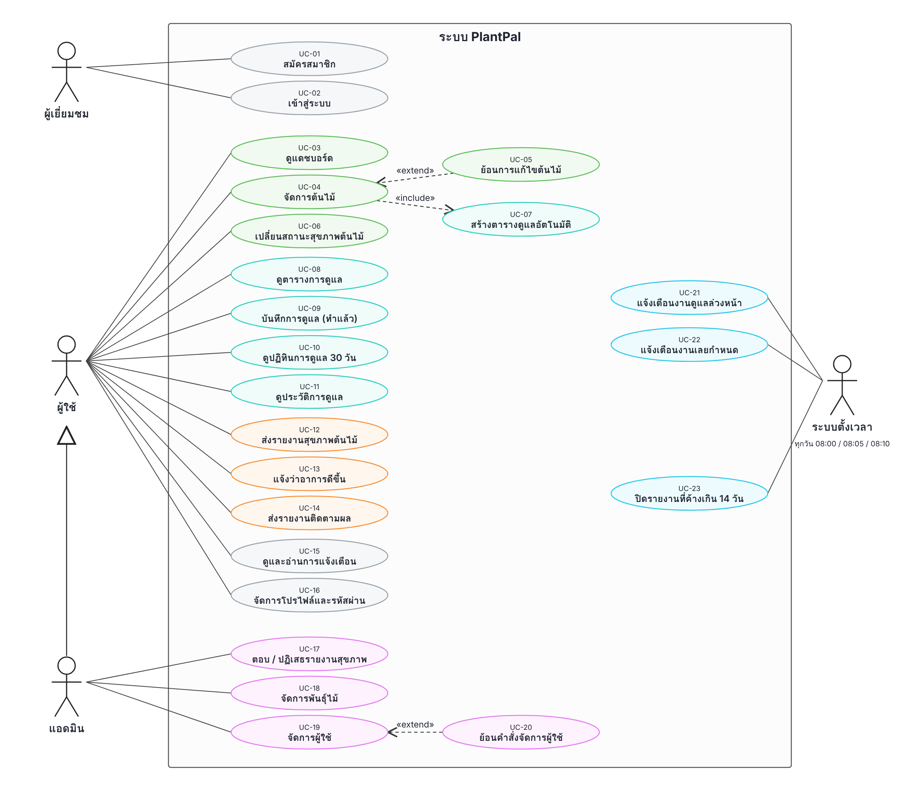

# Use Case — PlantPal

## Actor

| Actor | คำอธิบาย |
|---|---|
| ผู้เยี่ยมชม | คนที่ยังไม่ได้เข้าสู่ระบบ ทำได้แค่สมัครสมาชิกและเข้าสู่ระบบ |
| ผู้ใช้ | สมาชิก (role `USER`) ดูแลต้นไม้ของตัวเอง เห็นเฉพาะข้อมูลของตัวเอง |
| แอดมิน | ผู้ดูแลระบบ (role `ADMIN`) ทำได้ทุกอย่างที่ผู้ใช้ทำได้ และเข้าหน้า `/admin/**` ได้ |
| ระบบตั้งเวลา | งานที่รันเองทุกเช้าตามเวลาไทย (`@Scheduled`) ไม่มีคนกด |

## สรุป Use Case

| ID | Use Case | Actor | หน้า / URL |
|---|---|---|---|
| UC-01 | สมัครสมาชิก | ผู้เยี่ยมชม | `/register` |
| UC-02 | เข้าสู่ระบบ | ผู้เยี่ยมชม | `/login` |
| UC-03 | ดูแดชบอร์ด | ผู้ใช้ | `/dashboard` |
| UC-04 | จัดการต้นไม้ | ผู้ใช้ | `/plants`, `/api/v1/plants` |
| UC-05 | ย้อนการแก้ไขต้นไม้ | ผู้ใช้ | `POST /plants/{id}/undo` |
| UC-06 | เปลี่ยนสถานะสุขภาพต้นไม้ | ผู้ใช้ | `POST /plants/{id}/health` |
| UC-07 | สร้างตารางดูแลอัตโนมัติ | (ระบบ ต่อจาก UC-04) | — |
| UC-08 | ดูตารางการดูแล | ผู้ใช้ | `/care` |
| UC-09 | บันทึกการดูแล (ทำแล้ว) | ผู้ใช้ | `POST /care/done` |
| UC-10 | ดูปฏิทินการดูแล 30 วัน | ผู้ใช้ | `/care/calendar` |
| UC-11 | ดูประวัติการดูแล | ผู้ใช้ | `/care/history` |
| UC-12 | ส่งรายงานสุขภาพต้นไม้ | ผู้ใช้ | `/reports/new`, `/api/v1/reports` |
| UC-13 | แจ้งว่าอาการดีขึ้น | ผู้ใช้ | `POST /reports/{id}/improved` |
| UC-14 | ส่งรายงานติดตามผล | ผู้ใช้ | `POST /reports/{id}/follow-up` |
| UC-15 | ดูและอ่านการแจ้งเตือน | ผู้ใช้ | `/notifications` |
| UC-16 | จัดการโปรไฟล์และรหัสผ่าน | ผู้ใช้ | `/profile` |
| UC-17 | ตอบ / ปฏิเสธรายงานสุขภาพ | แอดมิน | `/admin/reports` |
| UC-18 | จัดการพันธุ์ไม้ | แอดมิน | `/admin/species` |
| UC-19 | จัดการผู้ใช้ | แอดมิน | `/admin/users` |
| UC-20 | ย้อนคำสั่งจัดการผู้ใช้ | แอดมิน | `POST /admin/users/undo` |
| UC-21 | แจ้งเตือนงานดูแลล่วงหน้า | ระบบตั้งเวลา | `CareDueReminderJob` (08:00) |
| UC-22 | แจ้งเตือนงานเลยกำหนด | ระบบตั้งเวลา | `OverdueCareReminderJob` (08:05) |
| UC-23 | ปิดรายงานที่ค้างเกิน 14 วัน | ระบบตั้งเวลา | `StaleReportCloseJob` (08:10) |

> Use Case ของผู้ใช้และแอดมินทุกตัว (UC-03 ถึง UC-20) ต้องเข้าสู่ระบบก่อน ระบบจะเห็นและแก้ได้เฉพาะข้อมูลของบัญชีตัวเอง

---

## รายละเอียด Use Case

### UC-01 สมัครสมาชิก
| หัวข้อ | รายละเอียด |
|---|---|
| Actor | ผู้เยี่ยมชม |
| เงื่อนไขก่อนเริ่ม | ยังไม่ได้เข้าสู่ระบบ |
| ขั้นตอนหลัก | 1. เปิดหน้าสมัครสมาชิก 2. กรอกอีเมล รหัสผ่าน และยืนยันรหัสผ่าน 3. ระบบตรวจข้อมูลทีละขั้น (รูปแบบอีเมล → อีเมลซ้ำ → รหัสผ่านอย่างน้อย 8 ตัว → รหัสผ่านตรงกัน) 4. บันทึกบัญชีใหม่ role `USER` พร้อมเข้ารหัสรหัสผ่านแบบ BCrypt |
| ทางเลือก / ข้อผิดพลาด | ขั้นใดไม่ผ่าน ระบบหยุดตรวจและแสดงข้อความ เช่น "อีเมลนี้ถูกใช้สมัครแล้ว", "รหัสผ่านไม่ตรงกัน" |
| ผลลัพธ์ | มีบัญชีใหม่ ใช้เข้าสู่ระบบได้ |

### UC-02 เข้าสู่ระบบ
| หัวข้อ | รายละเอียด |
|---|---|
| Actor | ผู้เยี่ยมชม |
| เงื่อนไขก่อนเริ่ม | มีบัญชีแล้ว |
| ขั้นตอนหลัก | 1. กรอกอีเมลและรหัสผ่าน 2. ระบบตรวจกับข้อมูลในฐานข้อมูล 3. เข้าหน้าแดชบอร์ด |
| ทางเลือก / ข้อผิดพลาด | รหัสผ่านผิด หรือบัญชีถูกแอดมินระงับ (`is_active = false`) จะเข้าสู่ระบบไม่ได้ |
| ผลลัพธ์ | ผู้เยี่ยมชมกลายเป็นผู้ใช้หรือแอดมินตาม role ของบัญชี |

### UC-03 ดูแดชบอร์ด
| หัวข้อ | รายละเอียด |
|---|---|
| Actor | ผู้ใช้ |
| ขั้นตอนหลัก | 1. เปิดหน้าแดชบอร์ด 2. ระบบนับจำนวนต้นไม้แยกตามสถานะสุขภาพ 3. แสดงงานดูแลที่ใกล้ถึงกำหนด (ใกล้สุดก่อน) และรายงานสุขภาพที่ยังรอผล (ใหม่สุดก่อน) |
| ผลลัพธ์ | เห็นภาพรวมต้นไม้และงานที่ต้องทำ |

### UC-04 จัดการต้นไม้
| หัวข้อ | รายละเอียด |
|---|---|
| Actor | ผู้ใช้ |
| ขั้นตอนหลัก | 1. เปิดหน้าต้นไม้ของฉัน 2. เพิ่มต้นไม้ (เลือกพันธุ์ ตั้งชื่อเล่น วันที่ปลูก) / แก้ไข / ลบ / ดูรายละเอียด 3. ระบบบันทึกและแสดงข้อความ "เพิ่มต้นไม้แล้ว", "แก้ไขข้อมูลต้นไม้แล้ว", "ลบต้นไม้แล้ว" |
| ความสัมพันธ์ | «include» UC-07 ทุกครั้งที่เพิ่มต้นไม้ใหม่ · ถูก «extend» โดย UC-05 หลังแก้ไข |
| ทางเลือก / ข้อผิดพลาด | เลือกพันธุ์ที่ไม่มีอยู่จะแจ้ง "ไม่พบพันธุ์ไม้ที่เลือก" · แก้หรือลบต้นไม้ของคนอื่นจะแจ้ง "ไม่พบต้นไม้นี้" · ทำผ่าน REST API `/api/v1/plants` ได้เช่นกัน (201 / 204 / 400 / 404) |
| ผลลัพธ์ | ข้อมูลต้นไม้ถูกบันทึก |

### UC-05 ย้อนการแก้ไขต้นไม้
| หัวข้อ | รายละเอียด |
|---|---|
| Actor | ผู้ใช้ |
| เงื่อนไขก่อนเริ่ม | เพิ่งแก้ไขข้อมูลต้นไม้ในรอบการใช้งานนี้ (ระบบเก็บค่าก่อนแก้ไว้) |
| ขั้นตอนหลัก | 1. กดย้อนการแก้ไขในหน้ารายละเอียดต้นไม้ 2. ระบบคืนค่าพันธุ์ ชื่อเล่น และวันที่ปลูกเป็นค่าก่อนแก้ 3. แจ้ง "ย้อนการแก้ไขล่าสุดแล้ว" |
| ทางเลือก / ข้อผิดพลาด | ไม่มีประวัติให้ย้อนจะแจ้ง "ไม่มีการแก้ไขให้ย้อน" · ย้อนได้ครั้งเดียวต่อการแก้ไข 1 ครั้ง |
| ผลลัพธ์ | ข้อมูลต้นไม้กลับเป็นค่าเดิม (Memento) |

### UC-06 เปลี่ยนสถานะสุขภาพต้นไม้
| หัวข้อ | รายละเอียด |
|---|---|
| Actor | ผู้ใช้ |
| ขั้นตอนหลัก | 1. เปิดหน้ารายละเอียดต้นไม้ 2. ระบบแสดงเฉพาะปุ่มสถานะที่เปลี่ยนไปได้ 3. เลือกสถานะใหม่ 4. แจ้ง "เปลี่ยนสถานะสุขภาพแล้ว" |
| ทางเลือก / ข้อผิดพลาด | เปลี่ยนในเส้นทางที่ไม่อนุญาต (เช่น ต้นที่ตายแล้ว หรือ HEALTHY → RECOVERING) จะไม่บันทึก |
| ผลลัพธ์ | สถานะสุขภาพเปลี่ยน ถ้าต้นไม้กลับมาเป็น HEALTHY (จาก SICK หรือ RECOVERING) ระบบนับจำนวนครั้งที่ฟื้นเพิ่ม 1 (State) |

### UC-07 สร้างตารางดูแลอัตโนมัติ
| หัวข้อ | รายละเอียด |
|---|---|
| Actor | ระบบ (เริ่มจาก UC-04 เมื่อเพิ่มต้นไม้ใหม่) |
| ขั้นตอนหลัก | 1. เมื่อบันทึกต้นไม้ใหม่ ระบบประกาศ `PlantCreatedEvent` 2. `CareServiceImpl` รับ event แล้วสร้างตารางดูแล 3 งาน: รดน้ำ ใส่ปุ๋ย เปลี่ยนกระถาง 3. คำนวณวันครบกำหนดครั้งแรกจากรอบของพันธุ์ไม้ (ไม่ได้ตั้งค่าใช้ 30 / 365 วัน) |
| ผลลัพธ์ | ต้นไม้ใหม่มีตารางดูแลทันทีโดยผู้ใช้ไม่ต้องตั้งเอง (Observer + Strategy) |

### UC-08 ดูตารางการดูแล
| หัวข้อ | รายละเอียด |
|---|---|
| Actor | ผู้ใช้ |
| ขั้นตอนหลัก | 1. เปิดหน้าการดูแล 2. ระบบแบ่งงานเป็น 3 กลุ่ม: เลยกำหนด / วันนี้ / ถัดไป 3. กรองตามประเภทงานได้ (รดน้ำ ใส่ปุ๋ย เปลี่ยนกระถาง ฯลฯ) |
| ทางเลือก / ข้อผิดพลาด | ไม่มีงานในกลุ่มที่เลือกจะแสดงกล่องว่าง |
| ผลลัพธ์ | เห็นงานดูแลของต้นไม้ทุกต้นของตัวเอง |

### UC-09 บันทึกการดูแล (ทำแล้ว)
| หัวข้อ | รายละเอียด |
|---|---|
| Actor | ผู้ใช้ |
| ขั้นตอนหลัก | 1. กด "ทำแล้ว" ที่งานดูแล ใส่หมายเหตุได้ 2. ระบบบันทึกประวัติการดูแล (`care_logs`) พร้อมวันครบกำหนดเดิมและเวลาที่ทำจริง 3. เลื่อนวันครบกำหนดครั้งถัดไปตามรอบของงานนั้น |
| ทางเลือก / ข้อผิดพลาด | กดกับตารางของคนอื่นจะแจ้ง "ไม่พบตารางดูแลนี้" · หมายเหตุว่างจะเก็บเป็นค่าว่าง |
| ผลลัพธ์ | งานย้ายไปรอบถัดไป และมีประวัติใน UC-11 |

### UC-10 ดูปฏิทินการดูแล 30 วัน
| หัวข้อ | รายละเอียด |
|---|---|
| Actor | ผู้ใช้ |
| ขั้นตอนหลัก | 1. เปิดหน้าปฏิทิน 2. ระบบเดินทีละวันตั้งแต่วันนี้ครบ 30 วัน และวางงานลงวันที่ครบกำหนด 3. ไฮไลต์วันนี้ และแสดงแถบเตือนจำนวนงานที่เลยกำหนดแล้ว |
| ทางเลือก / ข้อผิดพลาด | ไม่มีงานใน 30 วันจะแสดงกล่องว่าง · บนจอมือถือแสดงเป็นรายการเฉพาะวันที่มีงาน |
| ผลลัพธ์ | เห็นแผนการดูแลล่วงหน้า (Iterator) |

### UC-11 ดูประวัติการดูแล
| หัวข้อ | รายละเอียด |
|---|---|
| Actor | ผู้ใช้ |
| ขั้นตอนหลัก | 1. เปิดหน้าประวัติการดูแล 2. เลือกดูทุกต้นหรือเฉพาะต้น และกรองตามประเภทงาน 3. ระบบแสดงรายการล่าสุดก่อน บอกว่าทำตรงเวลาหรือช้า และสรุปจำนวนครั้งที่ตรงเวลา / ช้า |
| ผลลัพธ์ | เห็นว่าดูแลต้นไม้สม่ำเสมอแค่ไหน |

### UC-12 ส่งรายงานสุขภาพต้นไม้
| หัวข้อ | รายละเอียด |
|---|---|
| Actor | ผู้ใช้ |
| ขั้นตอนหลัก | 1. เลือกต้นไม้ เขียนอาการ แนบรูปได้ 2. ระบบบันทึกรายงานสถานะรอตอบ (PENDING) 3. แจ้งเตือนแอดมินทุกคน 4. แจ้ง "ส่งรายงานแล้ว ผู้ดูแลระบบจะตอบกลับเร็วๆ นี้" |
| ทางเลือก / ข้อผิดพลาด | ต้นนี้มีรายงานที่ยังไม่ปิดอยู่จะส่งซ้ำไม่ได้ · ไฟล์ว่างหรือไฟล์ SVG ถูกปฏิเสธ · ส่งผ่าน REST API ได้แต่แนบรูปไม่ได้ |
| ผลลัพธ์ | แอดมินเห็นรายงานใน UC-17 |

### UC-13 แจ้งว่าอาการดีขึ้น
| หัวข้อ | รายละเอียด |
|---|---|
| Actor | ผู้ใช้ |
| เงื่อนไขก่อนเริ่ม | รายงานอยู่ในสถานะกำลังดำเนินการ (แอดมินตอบแล้ว) |
| ขั้นตอนหลัก | 1. เปิดรายงาน กด "ต้นไม้ดีขึ้นแล้ว" 2. ระบบปิดรายงาน และเปลี่ยนต้นไม้เป็นกำลังฟื้นตัว (RECOVERING) |
| ทางเลือก / ข้อผิดพลาด | รายงานที่ยังไม่ถูกตอบหรือจบไปแล้วจะแจ้ง "อัปเดตผลได้เฉพาะรายงานที่กำลังดำเนินการ" |
| ผลลัพธ์ | รายงานจบ แจ้ง "บันทึกแล้ว ดีใจด้วยที่ต้นไม้ดีขึ้น" |

### UC-14 ส่งรายงานติดตามผล
| หัวข้อ | รายละเอียด |
|---|---|
| Actor | ผู้ใช้ |
| เงื่อนไขก่อนเริ่ม | รายงานอยู่ในสถานะกำลังดำเนินการ แต่ต้นไม้ยังไม่ดีขึ้น |
| ขั้นตอนหลัก | 1. กด "ยังไม่ดีขึ้น" เขียนอาการและแนบรูปใหม่ 2. ระบบปิดรอบเก่าและเปิดรายงานรอบใหม่ของปัญหาเดิม 3. แจ้งแอดมินว่าอาการยังไม่ดีขึ้น |
| ทางเลือก / ข้อผิดพลาด | อัปโหลดรูปไม่สำเร็จ รอบเก่ายังเปิดอยู่เหมือนเดิม |
| ผลลัพธ์ | แจ้ง "ส่งติดตามผลแล้ว ผู้ดูแลระบบจะตรวจอีกรอบ" และแอดมินเห็นรอบก่อนหน้าประกอบ |

### UC-15 ดูและอ่านการแจ้งเตือน
| หัวข้อ | รายละเอียด |
|---|---|
| Actor | ผู้ใช้ |
| ขั้นตอนหลัก | 1. เปิดหน้าการแจ้งเตือน (หรือดูจากกระดิ่งที่แถบด้านบน) 2. ระบบแสดงรายการใหม่สุดก่อน 3. กดอ่านทีละรายการ หรืออ่านทั้งหมด |
| ทางเลือก / ข้อผิดพลาด | อ่านการแจ้งเตือนของคนอื่นไม่ได้ |
| ผลลัพธ์ | การแจ้งเตือนเปลี่ยนเป็นอ่านแล้ว |

### UC-16 จัดการโปรไฟล์และรหัสผ่าน
| หัวข้อ | รายละเอียด |
|---|---|
| Actor | ผู้ใช้ |
| ขั้นตอนหลัก | 1. แก้ชื่อ นามสกุล เบอร์โทร และรูปโปรไฟล์ แล้วบันทึก 2. เปลี่ยนรหัสผ่านโดยกรอกรหัสเดิมและรหัสใหม่ 2 ครั้ง |
| ทางเลือก / ข้อผิดพลาด | "รหัสผ่านปัจจุบันไม่ถูกต้อง", "รหัสผ่านใหม่ไม่ตรงกัน", "รหัสผ่านใหม่ต้องไม่ซ้ำกับรหัสเดิม" |
| ผลลัพธ์ | แจ้ง "บันทึกข้อมูลแล้ว" หรือ "เปลี่ยนรหัสผ่านแล้ว" |

### UC-17 ตอบ / ปฏิเสธรายงานสุขภาพ
| หัวข้อ | รายละเอียด |
|---|---|
| Actor | แอดมิน |
| ขั้นตอนหลัก | 1. เปิดหน้ารายงานของแอดมิน กรองตามสถานะได้ 2. เลือกรายงาน ดูรอบก่อนหน้าของปัญหาเดียวกัน 3. "ส่งคำแนะนำ" → รายงานเป็นกำลังดำเนินการ และต้นไม้เป็นป่วย (หรือสถานะที่แอดมินเลือก) หรือ "ปฏิเสธ" พร้อมเหตุผล → ปิดรายงาน 4. ระบบแจ้งเจ้าของต้นไม้ |
| ทางเลือก / ข้อผิดพลาด | ไม่เขียนคำแนะนำหรือเหตุผลจะถูกปฏิเสธ · รายงานที่จบแล้วตอบเพิ่มไม่ได้ · เลือกสถานะต้นไม้ที่เปลี่ยนไม่ได้ จะยกเลิกทั้งหมดและไม่ส่งแจ้งเตือน |
| ผลลัพธ์ | เจ้าของต้นไม้ได้รับคำแนะนำหรือเหตุผลที่ปฏิเสธ |

### UC-18 จัดการพันธุ์ไม้
| หัวข้อ | รายละเอียด |
|---|---|
| Actor | แอดมิน |
| ขั้นตอนหลัก | 1. เปิดหน้าพันธุ์ไม้ 2. เพิ่มหรือแก้ไขชื่อพันธุ์และรอบการดูแล (รดน้ำ ใส่ปุ๋ย เปลี่ยนกระถาง) 3. ลบพันธุ์ที่ไม่ใช้แล้ว |
| ทางเลือก / ข้อผิดพลาด | ชื่อพันธุ์ซ้ำจะบันทึกไม่ได้ · พันธุ์ที่มีต้นไม้ของผู้ใช้ใช้อยู่จะแจ้ง "ลบไม่ได้ เพราะมีต้นไม้ของผู้ใช้ใช้พันธุ์นี้อยู่" |
| ผลลัพธ์ | รายการพันธุ์ไม้ที่ผู้ใช้เลือกได้ และรอบที่ใช้คำนวณตารางดูแลถูกอัปเดต |

### UC-19 จัดการผู้ใช้
| หัวข้อ | รายละเอียด |
|---|---|
| Actor | แอดมิน |
| ขั้นตอนหลัก | 1. เปิดหน้าผู้ใช้ 2. เปลี่ยนบทบาท (USER ↔ ADMIN) หรือระงับ / เปิดใช้บัญชี 3. ระบบบันทึกทันทีและเก็บคำสั่งไว้ให้ย้อนได้ |
| ความสัมพันธ์ | ถูก «extend» โดย UC-20 |
| ทางเลือก / ข้อผิดพลาด | "เปลี่ยนบทบาทหรือระงับบัญชีของตัวเองไม่ได้" |
| ผลลัพธ์ | บัญชีที่ถูกระงับเข้าสู่ระบบไม่ได้ (UC-02) |

### UC-20 ย้อนคำสั่งจัดการผู้ใช้
| หัวข้อ | รายละเอียด |
|---|---|
| Actor | แอดมิน |
| เงื่อนไขก่อนเริ่ม | เคยเปลี่ยนบทบาทหรือระงับบัญชีในรอบการใช้งานนี้ |
| ขั้นตอนหลัก | 1. กดย้อนกลับ 2. ระบบย้อนคำสั่งล่าสุดก่อน (เก็บประวัติได้ 10 คำสั่งล่าสุด แยกตามแอดมินแต่ละคน) |
| ผลลัพธ์ | บทบาทหรือสถานะบัญชีกลับเป็นค่าเดิม (Command) |

### UC-21 แจ้งเตือนงานดูแลล่วงหน้า
| หัวข้อ | รายละเอียด |
|---|---|
| Actor | ระบบตั้งเวลา (ทุกวัน 08:00 เวลาไทย) |
| ขั้นตอนหลัก | 1. หางานดูแลที่ครบกำหนดพรุ่งนี้ของผู้ใช้ทุกคน 2. ประกาศ `CareDueEvent` ทีละงาน 3. สร้างการแจ้งเตือนให้เจ้าของต้นไม้ |
| ทางเลือก / ข้อผิดพลาด | ไม่มีงานครบกำหนดจะไม่ส่งอะไร · ต้นที่ไม่มีชื่อเล่นใช้ชื่อพันธุ์แทน |
| ผลลัพธ์ | ผู้ใช้เห็นการแจ้งเตือนใน UC-15 |

### UC-22 แจ้งเตือนงานเลยกำหนด
| หัวข้อ | รายละเอียด |
|---|---|
| Actor | ระบบตั้งเวลา (ทุกวัน 08:05 เวลาไทย) |
| ขั้นตอนหลัก | 1. หางานดูแลที่เลยกำหนดแล้วของผู้ใช้ทุกคน 2. สร้างการแจ้งเตือนที่ระบุวันครบกำหนดเดิม |
| ผลลัพธ์ | ผู้ใช้รู้ว่ามีงานค้าง และไปบันทึกใน UC-09 ได้ |

### UC-23 ปิดรายงานที่ค้างเกิน 14 วัน
| หัวข้อ | รายละเอียด |
|---|---|
| Actor | ระบบตั้งเวลา (ทุกวัน 08:10 เวลาไทย) |
| ขั้นตอนหลัก | 1. หารายงานที่แอดมินตอบแล้วแต่ผู้ใช้ไม่อัปเดตผลเกิน 14 วัน 2. ปิดรายงานเป็นปิดอัตโนมัติ (สถานะสุขภาพต้นไม้ไม่เปลี่ยน) 3. แจ้งเจ้าของว่าส่งรายงานใหม่ได้ |
| ทางเลือก / ข้อผิดพลาด | ไม่มีรายงานค้างจะไม่ปิดอะไร |
| ผลลัพธ์ | ต้นไม้นั้นส่งรายงานใหม่ได้อีกครั้ง (UC-12) |
