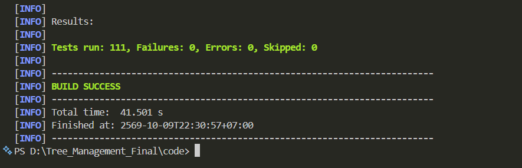

# Test Report — PlantPal

รายงานผลการทดสอบ Unit Test ของระบบ PlantPal (Tree Management and Care Tracking System)

## 1. ข้อมูลการทดสอบ

| หัวข้อ | รายละเอียด |
|---|---|
| เครื่องมือ | JUnit 5, Mockito, AssertJ (spring-boot-starter-test) |
| ภาษา / Framework | Java 21, Spring Boot 4.1.1 |
| คำสั่งรัน | `cd code` แล้ว `.\mvnw test` (Windows) หรือ `./mvnw test` |
| CI | GitHub Actions (`.github/workflows/ci.yml`) รันเทสต์ทุก push / PR เข้า develop และ main |
| วันที่ทดสอบ | 9 ตุลาคม 2569 (2026-10-09)  |

## 2. สรุปผล

| สมาชิก | Test Class | Test Case | ผ่าน | ไม่ผ่าน |
|---|---:|---:|---:|---:|
| สรนันท์ | 4 | 23 | 23 | 0 |
| กมลพร | 8 | 54 | 54 | 0 |
| มุกดา | 5 | 20 | 20 | 0 |
| พรีมภัทร | 5 | 13 | 13 | 0 |
| ทีม | 1 | 1 | 1 | 0 |
| **รวม** | **23** | **111** | **111** | **0** |

ผลจาก Maven: `Tests run: 111, Failures: 0, Errors: 0, Skipped: 0` — `BUILD SUCCESS`

## 3. รายละเอียด Test Case

### 3.1 สรนันท์

**CareIntervalStrategyTest**  การดูแลต้นไม้ (Strategy)  
`code/src/test/java/com/example/plantpal/service/strategy/CareIntervalStrategyTest.java`

| Test ID | Test Method | สิ่งที่ทดสอบ | ผลที่คาดหวัง | ผล |
|---|---|---|---|:---:|
| TC-CARE-01 | `waterUsesSpeciesWaterInterval` | รดน้ำใช้รอบวันตามพันธุ์ไม้ | ได้จำนวนวันเท่ากับ waterIntervalDays ของพันธุ์ (3 วัน) | ✅ ผ่าน |
| TC-CARE-02 | `fertilizeUsesSpeciesIntervalWhenSet` | ใส่ปุ๋ยเมื่อพันธุ์ตั้งรอบไว้ | ได้ 14 วันตามที่ตั้ง | ✅ ผ่าน |
| TC-CARE-03 | `fertilizeUsesDefaultWhenSpeciesIntervalIsNull` | ใส่ปุ๋ยเมื่อพันธุ์ไม่ได้ตั้งรอบ (null) | ใช้ค่าเริ่มต้น 30 วัน | ✅ ผ่าน |
| TC-CARE-04 | `fertilizeUsesDefaultWhenSpeciesIntervalIsZero` | ใส่ปุ๋ยเมื่อรอบเป็น 0 | ใช้ค่าเริ่มต้น 30 วัน | ✅ ผ่าน |
| TC-CARE-05 | `repotUsesSpeciesIntervalWhenSet` | เปลี่ยนกระถางเมื่อพันธุ์ตั้งรอบไว้ | ได้ 180 วันตามที่ตั้ง | ✅ ผ่าน |
| TC-CARE-06 | `repotUsesDefaultWhenSpeciesIntervalIsNull` | เปลี่ยนกระถางเมื่อไม่ได้ตั้งรอบ | ใช้ค่าเริ่มต้น 365 วัน | ✅ ผ่าน |

**CareIntervalCalculatorTest**  การดูแลต้นไม้ (Strategy)  
`code/src/test/java/com/example/plantpal/service/strategy/CareIntervalCalculatorTest.java`

| Test ID | Test Method | สิ่งที่ทดสอบ | ผลที่คาดหวัง | ผล |
|---|---|---|---|:---:|
| TC-CARE-07 | `picksStrategyByActionType` | เลือก Strategy ตามประเภทงาน | WATER=7, FERTILIZE=30, REPOT=288 วัน | ✅ ผ่าน |
| TC-CARE-08 | `usesFallbackForTypesWithoutStrategy` | ประเภทงานที่ไม่มี Strategy (เช็กแดด, ตรวจสุขภาพ) | ใช้ค่า fallback 7 วัน | ✅ ผ่าน |
| TC-CARE-09 | `supportedTypesAreTheAutoCreatedSchedules` | ประเภทงานที่สร้างตารางอัตโนมัติ | ได้ {WATER, FERTILIZE, REPOT} | ✅ ผ่าน |
| TC-CARE-10 | `nextDueDateAddsIntervalToStartDate` | คำนวณวันครบกำหนดถัดไป | 2026-10-08 + 7 วัน = 2026-10-15 | ✅ ผ่าน |

**CareCalendarIteratorTest**  ปฏิทินการดูแล (Iterator)  
`code/src/test/java/com/example/plantpal/iterator/CareCalendarIteratorTest.java`

| Test ID | Test Method | สิ่งที่ทดสอบ | ผลที่คาดหวัง | ผล |
|---|---|---|---|:---:|
| TC-CARE-11 | `walksExactlyTheRequestedNumberOfDays` | เดินปฏิทินตามจำนวนวันที่ขอ | ได้ครบ 30 วันพอดี | ✅ ผ่าน |
| TC-CARE-12 | `onlyFirstDayIsMarkedToday` | การระบุ "วันนี้" | มีแค่วันแรกที่ today = true | ✅ ผ่าน |
| TC-CARE-13 | `putsTasksOnTheirDueDate` | วางงานลงวันตามวันครบกำหนด | งานอยู่ในวันที่ตรงกับ nextDueDate | ✅ ผ่าน |
| TC-CARE-14 | `nextAfterLastDayThrows` | เรียก next() หลังวันสุดท้าย | เกิด NoSuchElementException | ✅ ผ่าน |
| TC-CARE-15 | `rejectsZeroDays` | สร้างปฏิทิน 0 วัน | เกิด IllegalArgumentException | ✅ ผ่าน |

**CareServiceImplTest**  การดูแลต้นไม้ (Service)  
`code/src/test/java/com/example/plantpal/service/impl/CareServiceImplTest.java`

| Test ID | Test Method | สิ่งที่ทดสอบ | ผลที่คาดหวัง | ผล |
|---|---|---|---|:---:|
| TC-CARE-16 | `markDoneSavesLogWithOriginalDueDate` | กด "ทำแล้ว" บันทึกประวัติ | care_log เก็บวันครบกำหนดเดิมไว้ | ✅ ผ่าน |
| TC-CARE-17 | `markDoneMovesNextDueDateByStrategy` | กด "ทำแล้ว" เลื่อนวันครบกำหนด | nextDueDate = วันนี้ + 3 วัน (ตาม Strategy) | ✅ ผ่าน |
| TC-CARE-18 | `markDoneStoresBlankNotesAsNull` | บันทึกหมายเหตุที่เป็นช่องว่าง | notes ถูกเก็บเป็น null | ✅ ผ่าน |
| TC-CARE-19 | `markDoneRejectsScheduleOfOtherUser` | กด "ทำแล้ว" กับตารางของผู้ใช้อื่น | เกิด IllegalArgumentException และไม่บันทึก | ✅ ผ่าน |
| TC-CARE-20 | `isLateWhenDoneAfterDueDate` | ตรวจว่าทำช้ากว่ากำหนด | ทำหลังวันครบกำหนดได้ isLate = true | ✅ ผ่าน |
| TC-CARE-21 | `historySummaryCountsOnTimeAndLate` | สรุปประวัติการดูแล | ตรงเวลา 2 ครั้ง ช้า 1 ครั้ง | ✅ ผ่าน |
| TC-CARE-22 | `historySummaryOfOnePlantUsesPlantQuery` | สรุปประวัติเฉพาะต้นเดียว | เรียก query ของต้นนั้น ไม่ดึงทุกต้น | ✅ ผ่าน |
| TC-CARE-23 | `onPlantCreatedCreatesWaterFertilizeAndRepotSchedules` | เพิ่มต้นไม้ใหม่ (Observer) | สร้างตาราง 3 งาน รดน้ำครบกำหนดวันนี้ + 3 | ✅ ผ่าน |

### 3.2 กมลพร

**HealthReportServiceImplTest**  รายงานสุขภาพต้นไม้  
`code/src/test/java/com/example/plantpal/service/impl/HealthReportServiceImplTest.java`

| Test ID | Test Method | สิ่งที่ทดสอบ | ผลที่คาดหวัง | ผล |
|---|---|---|---|:---:|
| TC-HR-01 | `createSavesPendingReportWithTrimmedText` | สร้างรายงานสุขภาพ | บันทึกสถานะ PENDING และตัดช่องว่างข้อความ | ✅ ผ่าน |
| TC-HR-02 | `createPublishesSubmittedEventForAdmins` | สร้างรายงานแล้วแจ้งแอดมิน | ส่ง event รายงานใหม่ | ✅ ผ่าน |
| TC-HR-03 | `createWithImageStoresUploadedUrl` | สร้างรายงานพร้อมรูป | เก็บ URL รูปที่อัปโหลด | ✅ ผ่าน |
| TC-HR-04 | `createWhenPlantHasOpenReportThrowsConflictAndUploadsNothing` | สร้างรายงานซ้ำขณะยังมีรายงานเปิดอยู่ | ถูกปฏิเสธ (conflict) และไม่อัปโหลดรูป | ✅ ผ่าน |
| TC-HR-05 | `findMyReportOfOtherUserThrowsNotFound` | ดูรายงานของผู้ใช้อื่น | เกิด Not Found | ✅ ผ่าน |
| TC-HR-06 | `answerMovesReportToInProgressMarksPlantSickAndPublishesEvent` | แอดมินตอบรายงาน | รายงานเป็น IN_PROGRESS ต้นไม้เป็น SICK และส่ง event | ✅ ผ่าน |
| TC-HR-07 | `answerOnDeadPlantKeepsHealthButStillSavesReply` | ตอบรายงานของต้นที่ตายแล้ว | สถานะต้นไม่เปลี่ยน แต่บันทึกคำตอบ | ✅ ผ่าน |
| TC-HR-08 | `rejectClosesReportWithReason` | ปฏิเสธรายงานพร้อมเหตุผล | รายงานถูกปิดพร้อมเหตุผล | ✅ ผ่าน |
| TC-HR-09 | `rejectWithoutReasonIsRefused` | ปฏิเสธโดยไม่ใส่เหตุผล | ไม่อนุญาต | ✅ ผ่าน |
| TC-HR-10 | `answerWithoutAdviceIsRefused` | ตอบโดยไม่ใส่คำแนะนำ | ไม่อนุญาต | ✅ ผ่าน |
| TC-HR-11 | `adminCannotSetResolvedDirectly` | แอดมินตั้งสถานะ RESOLVED เอง | ไม่อนุญาต | ✅ ผ่าน |
| TC-HR-12 | `replyToClosedReportIsRefused` | ตอบรายงานที่ปิดแล้ว | ไม่อนุญาต | ✅ ผ่าน |
| TC-HR-13 | `replyToFollowedUpReportIsRefused` | ตอบรายงานที่ถูกติดตามผลแล้ว | ไม่อนุญาต | ✅ ผ่าน |
| TC-HR-14 | `replyWithAdminChosenPlantStatusUsesItInsteadOfAutomatic` | แอดมินเลือกสถานะต้นไม้เอง | ใช้สถานะที่แอดมินเลือกแทนค่าอัตโนมัติ | ✅ ผ่าน |
| TC-HR-15 | `replyWithNotAllowedPlantStatusFailsAndPublishesNothing` | เลือกสถานะต้นไม้ที่เปลี่ยนไม่ได้ | ล้มเหลวและไม่ส่ง event | ✅ ผ่าน |
| TC-HR-16 | `markImprovedClosesReportAndMarksPlantRecovering` | เจ้าของแจ้งว่าอาการดีขึ้น | ปิดรายงาน ต้นไม้เป็น RECOVERING | ✅ ผ่าน |
| TC-HR-17 | `markImprovedOnPendingReportIsRejected` | แจ้งดีขึ้นขณะรายงานยังรอตอบ | ไม่อนุญาต | ✅ ผ่าน |
| TC-HR-18 | `followUpClosesPreviousAndOpensNewReportWithNewImage` | ส่งรายงานติดตามผล | ปิดรอบเก่า เปิดรอบใหม่พร้อมรูปใหม่ | ✅ ผ่าน |
| TC-HR-19 | `followUpTwiceDoesNotRepeatPrefix` | ติดตามผล 2 ครั้ง | คำนำหน้าข้อความไม่ซ้ำ | ✅ ผ่าน |
| TC-HR-20 | `followUpWithFailedUploadKeepsPreviousOpen` | ติดตามผลแต่อัปโหลดรูปล้มเหลว | รายงานรอบเก่ายังเปิดอยู่ | ✅ ผ่าน |
| TC-HR-21 | `autoCloseMarksReportAutoClosedKeepsPlantHealthAndNotifiesOwner` | ปิดรายงานอัตโนมัติ | สถานะ AUTO_CLOSED สุขภาพต้นไม่เปลี่ยน และแจ้งเจ้าของ | ✅ ผ่าน |
| TC-HR-22 | `replyToMissingReportThrowsNotFoundAndPublishesNothing` | ตอบรายงานที่ไม่มีอยู่ | เกิด Not Found และไม่ส่ง event | ✅ ผ่าน |
| TC-HR-23 | `latestRoundsWithoutStatusFilterHidesFollowedUpRounds` | รายการรอบล่าสุด (ไม่กรองสถานะ) | ซ่อนรอบที่ถูกติดตามผลแล้ว | ✅ ผ่าน |
| TC-HR-24 | `latestRoundsWithStatusFilterShowsThatStatusEvenIfNotLatest` | รายการรอบล่าสุด (กรองสถานะ) | แสดงรายงานสถานะนั้นแม้ไม่ใช่รอบล่าสุด | ✅ ผ่าน |
| TC-HR-25 | `previousRoundsOnlyFollowTheSameIssue` | ดูรอบก่อนหน้า | แสดงเฉพาะรอบของปัญหาเดียวกัน | ✅ ผ่าน |
| TC-HR-26 | `firstRoundHasNoPreviousRounds` | รอบแรกของรายงาน | ไม่มีรอบก่อนหน้า | ✅ ผ่าน |

**NotificationServiceImplTest**  การแจ้งเตือน  
`code/src/test/java/com/example/plantpal/service/impl/NotificationServiceImplTest.java`

| Test ID | Test Method | สิ่งที่ทดสอบ | ผลที่คาดหวัง | ผล |
|---|---|---|---|:---:|
| TC-HR-27 | `createSavesUnreadNotificationLinkedToUserAndPlant` | สร้างการแจ้งเตือน | บันทึกเป็นยังไม่อ่าน ผูกกับผู้ใช้และต้นไม้ | ✅ ผ่าน |
| TC-HR-28 | `createWithoutPlantLeavesPlantEmpty` | สร้างการแจ้งเตือนที่ไม่เกี่ยวกับต้นไม้ | ช่องต้นไม้ว่าง | ✅ ผ่าน |
| TC-HR-29 | `createCutsMessageLongerThanColumnLimit` | ข้อความยาวเกินคอลัมน์ | ตัดข้อความให้พอดีความยาวที่กำหนด | ✅ ผ่าน |
| TC-HR-30 | `findLatestAsksForNewestFirstWithLimit` | ดึงการแจ้งเตือนล่าสุด | เรียงใหม่สุดก่อนและจำกัดจำนวน | ✅ ผ่าน |
| TC-HR-31 | `markAsReadSetsOwnNotificationRead` | อ่านการแจ้งเตือนของตัวเอง | สถานะเป็นอ่านแล้ว | ✅ ผ่าน |
| TC-HR-32 | `markAsReadOfOtherUserThrowsNotFound` | อ่านการแจ้งเตือนของผู้ใช้อื่น | เกิด Not Found | ✅ ผ่าน |
| TC-HR-33 | `markAllAsReadReturnsUpdatedCount` | อ่านทั้งหมด | คืนจำนวนรายการที่อัปเดต | ✅ ผ่าน |

**NotificationListenerTest**  การแจ้งเตือน (Observer)  
`code/src/test/java/com/example/plantpal/event/NotificationListenerTest.java`

| Test ID | Test Method | สิ่งที่ทดสอบ | ผลที่คาดหวัง | ผล |
|---|---|---|---|:---:|
| TC-HR-34 | `newReportNotifiesEveryAdmin` | มีรายงานใหม่ | แจ้งแอดมินทุกคน | ✅ ผ่าน |
| TC-HR-35 | `followUpReportTellsAdminItIsNotBetter` | มีรายงานติดตามผล | แจ้งแอดมินว่าอาการยังไม่ดีขึ้น | ✅ ผ่าน |
| TC-HR-36 | `adminWhoReportedDoesNotNotifyThemself` | แอดมินส่งรายงานเอง | ไม่แจ้งเตือนตัวเอง | ✅ ผ่าน |
| TC-HR-37 | `reportResolvedCreatesHealthReplyForOwner` | รายงานได้รับการแก้ไข | แจ้งเจ้าของต้นไม้ | ✅ ผ่าน |
| TC-HR-38 | `reportRejectedUsesClosedMessage` | รายงานถูกปฏิเสธ | ใช้ข้อความแจ้งปิดรายงาน | ✅ ผ่าน |
| TC-HR-39 | `autoClosedReportTellsOwnerTheyCanReportAgain` | รายงานถูกปิดอัตโนมัติ | แจ้งเจ้าของว่าส่งรายงานใหม่ได้ | ✅ ผ่าน |
| TC-HR-40 | `careDueTomorrowCreatesCareDueReminder` | งานดูแลครบกำหนดพรุ่งนี้ | สร้างการแจ้งเตือนล่วงหน้า | ✅ ผ่าน |
| TC-HR-41 | `overdueCareMentionsDueDate` | งานดูแลเลยกำหนด | ข้อความระบุวันครบกำหนด | ✅ ผ่าน |

**CareReminderJobsTest**  งานตั้งเวลา (Template Method)  
`code/src/test/java/com/example/plantpal/job/CareReminderJobsTest.java`

| Test ID | Test Method | สิ่งที่ทดสอบ | ผลที่คาดหวัง | ผล |
|---|---|---|---|:---:|
| TC-HR-42 | `dueReminderPublishesOneEventPerScheduleDueTomorrow` | แจ้งเตือนงานที่ครบกำหนดพรุ่งนี้ | ส่ง event 1 ครั้งต่อ 1 ตาราง | ✅ ผ่าน |
| TC-HR-43 | `overdueReminderMarksEventsOverdue` | แจ้งเตือนงานเลยกำหนด | event ถูกระบุว่าเลยกำหนด | ✅ ผ่าน |
| TC-HR-44 | `plantWithoutNicknameUsesSpeciesName` | ต้นไม้ที่ไม่มีชื่อเล่น | ใช้ชื่อพันธุ์แทน | ✅ ผ่าน |
| TC-HR-45 | `noTargetsPublishesNothing` | ไม่มีงานที่ต้องแจ้ง | ไม่ส่ง event | ✅ ผ่าน |

**StaleReportCloseJobTest**  งานตั้งเวลา (Template Method)  
`code/src/test/java/com/example/plantpal/job/StaleReportCloseJobTest.java`

| Test ID | Test Method | สิ่งที่ทดสอบ | ผลที่คาดหวัง | ผล |
|---|---|---|---|:---:|
| TC-HR-46 | `closesEveryReportOlderThan14Days` | ปิดรายงานที่ค้างเกิน 14 วัน | ปิดครบทุกรายงาน (2 รายการ) | ✅ ผ่าน |
| TC-HR-47 | `nothingStaleClosesNothing` | ไม่มีรายงานค้าง | ไม่ปิดรายงานใดเลย | ✅ ผ่าน |

**CloudinaryImageStorageServiceTest**  อัปโหลดรูปภาพ  
`code/src/test/java/com/example/plantpal/service/impl/CloudinaryImageStorageServiceTest.java`

| Test ID | Test Method | สิ่งที่ทดสอบ | ผลที่คาดหวัง | ผล |
|---|---|---|---|:---:|
| TC-HR-48 | `emptyFileIsRejected` | อัปโหลดไฟล์ว่าง | ถูกปฏิเสธ | ✅ ผ่าน |
| TC-HR-49 | `svgIsRejectedBecauseItCanContainScript` | อัปโหลดไฟล์ SVG | ถูกปฏิเสธ (อาจมีสคริปต์) | ✅ ผ่าน |
| TC-HR-50 | `validImageWithoutCloudinaryKeyIsServerError` | รูปถูกต้องแต่ไม่ได้ตั้งค่า Cloudinary | เกิด Server Error | ✅ ผ่าน |

**HealthReportMapperTest**  รายงานสุขภาพ (Mapper/Label)  
`code/src/test/java/com/example/plantpal/mapper/HealthReportMapperTest.java`

| Test ID | Test Method | สิ่งที่ทดสอบ | ผลที่คาดหวัง | ผล |
|---|---|---|---|:---:|
| TC-HR-51 | `toResponseCopiesAllFields` | แปลง HealthReport เป็น Response | คัดลอกข้อมูลครบทุกช่อง | ✅ ผ่าน |

**ReportLabelsTest**  รายงานสุขภาพ (Mapper/Label)  
`code/src/test/java/com/example/plantpal/controller/web/ReportLabelsTest.java`

| Test ID | Test Method | สิ่งที่ทดสอบ | ผลที่คาดหวัง | ผล |
|---|---|---|---|:---:|
| TC-HR-52 | `openReportWaitsForResult` | ป้ายของรายงานที่ยังเปิด | แสดงว่ารอผล | ✅ ผ่าน |
| TC-HR-53 | `finishedReportShowsHowItEnded` | ป้ายของรายงานที่จบแล้ว | แสดงผลลัพธ์การจบ | ✅ ผ่าน |
| TC-HR-54 | `everyFinishedStatusCountsAsClosed` | สถานะจบทุกแบบ | นับเป็นปิดแล้วทั้งหมด | ✅ ผ่าน |

### 3.3 มุกดา

**PlantApiControllerTest**  REST API ต้นไม้  
`code/src/test/java/com/example/plantpal/controller/api/PlantApiControllerTest.java`

| Test ID | Test Method | สิ่งที่ทดสอบ | ผลที่คาดหวัง | ผล |
|---|---|---|---|:---:|
| TC-PLT-01 | `listReturnsMyPlantsAsPage` | GET รายการต้นไม้ของฉัน | คืนข้อมูลแบบแบ่งหน้า 1 รายการ | ✅ ผ่าน |
| TC-PLT-02 | `getOtherUsersPlantReturns404` | GET ต้นไม้ของผู้ใช้อื่น | 404 Not Found | ✅ ผ่าน |
| TC-PLT-03 | `createReturns201WithLocation` | POST สร้างต้นไม้ | 201 Created พร้อม Location /api/v1/plants/5 | ✅ ผ่าน |
| TC-PLT-04 | `createWithUnknownSpeciesReturns400` | POST ด้วยพันธุ์ที่ไม่มีอยู่ | 400 Bad Request | ✅ ผ่าน |
| TC-PLT-05 | `updateUsesIdFromUrl` | PUT แก้ไขต้นไม้ | ใช้ id จาก URL แทน id ใน JSON | ✅ ผ่าน |
| TC-PLT-06 | `deleteReturns204` | DELETE ลบต้นไม้ | 204 No Content | ✅ ผ่าน |
| TC-PLT-07 | `deleteOtherUsersPlantReturns404AndDeletesNothing` | DELETE ต้นไม้ของผู้ใช้อื่น | 404 และไม่ลบข้อมูล | ✅ ผ่าน |

**PlantHealthStateTest**  สุขภาพต้นไม้ (State)  
`code/src/test/java/com/example/plantpal/plant/state/PlantHealthStateTest.java`

| Test ID | Test Method | สิ่งที่ทดสอบ | ผลที่คาดหวัง | ผล |
|---|---|---|---|:---:|
| TC-PLT-08 | `healthyCanBecomeSick` | HEALTHY → SICK | เปลี่ยนได้ | ✅ ผ่าน |
| TC-PLT-09 | `fullRecoveryIncreasesRecoveryCount` | หายป่วยสมบูรณ์ | จำนวนครั้งที่ฟื้นตัวเพิ่มขึ้น | ✅ ผ่าน |
| TC-PLT-10 | `healthyCannotJumpToRecovering` | HEALTHY → RECOVERING | เปลี่ยนไม่ได้ | ✅ ผ่าน |
| TC-PLT-11 | `deadIsFinal` | สถานะ DEAD | เปลี่ยนเป็นสถานะอื่นไม่ได้ | ✅ ผ่าน |
| TC-PLT-12 | `sameStatusDoesNothing` | เปลี่ยนเป็นสถานะเดิม | ไม่มีการเปลี่ยนแปลง | ✅ ผ่าน |
| TC-PLT-13 | `nextOfSickListsAllowedTargets` | สถานะที่ไปต่อได้จาก SICK | ได้รายการสถานะที่อนุญาต | ✅ ผ่าน |

**PlantServiceImplHealthTest**  สุขภาพต้นไม้ (State)  
`code/src/test/java/com/example/plantpal/service/impl/PlantServiceImplHealthTest.java`

| Test ID | Test Method | สิ่งที่ทดสอบ | ผลที่คาดหวัง | ผล |
|---|---|---|---|:---:|
| TC-PLT-14 | `markSickSavesNewStatus` | ตั้งต้นไม้เป็นป่วย | บันทึกสถานะใหม่ | ✅ ผ่าน |
| TC-PLT-15 | `changeMyPlantHealthChecksOwner` | เปลี่ยนสุขภาพต้นไม้ | ตรวจสอบว่าเป็นเจ้าของ | ✅ ผ่าน |
| TC-PLT-16 | `invalidTransitionIsNotSaved` | เปลี่ยนสถานะที่ไม่อนุญาต | ไม่บันทึก | ✅ ผ่าน |

**PlantServiceImplUndoTest**  ย้อนการแก้ไข (Memento)  
`code/src/test/java/com/example/plantpal/service/impl/PlantServiceImplUndoTest.java`

| Test ID | Test Method | สิ่งที่ทดสอบ | ผลที่คาดหวัง | ผล |
|---|---|---|---|:---:|
| TC-PLT-17 | `undoRestoresValuesBeforeEdit` | ย้อนการแก้ไขต้นไม้ | ค่ากลับเป็นก่อนแก้ไข | ✅ ผ่าน |
| TC-PLT-18 | `undoWithoutHistoryFails` | ย้อนกลับโดยไม่มีประวัติ | ล้มเหลว | ✅ ผ่าน |
| TC-PLT-19 | `cannotUndoOtherUsersPlant` | ย้อนการแก้ไขต้นไม้ของผู้ใช้อื่น | ไม่อนุญาต | ✅ ผ่าน |

**PlantMapperTest**  REST API ต้นไม้  
`code/src/test/java/com/example/plantpal/mapper/PlantMapperTest.java`

| Test ID | Test Method | สิ่งที่ทดสอบ | ผลที่คาดหวัง | ผล |
|---|---|---|---|:---:|
| TC-PLT-20 | `toResponseCopiesPlantAndSpeciesFields` | แปลง Plant เป็น Response | คัดลอกข้อมูลต้นไม้และพันธุ์ครบ | ✅ ผ่าน |

### 3.4 พรีมภัทร

**RegisterValidationChainTest**  สมัครสมาชิก (Chain of Responsibility)  
`code/src/test/java/com/example/plantpal/validation/RegisterValidationChainTest.java`

| Test ID | Test Method | สิ่งที่ทดสอบ | ผลที่คาดหวัง | ผล |
|---|---|---|---|:---:|
| TC-USR-01 | `validRequest_passesWholeChain` | ข้อมูลสมัครถูกต้อง | ผ่านทุกขั้นตอนตรวจสอบ | ✅ ผ่าน |
| TC-USR-02 | `invalidEmail_stopsAtFirstStep_andNeverQueriesDatabase` | อีเมลรูปแบบผิด | หยุดที่ขั้นแรก ไม่ query ฐานข้อมูล | ✅ ผ่าน |
| TC-USR-03 | `emailAlreadyUsed_isRejected` | อีเมลถูกใช้แล้ว | ถูกปฏิเสธ "อีเมลนี้ถูกใช้สมัครแล้ว" | ✅ ผ่าน |
| TC-USR-04 | `passwordShorterThan8_isRejected` | รหัสผ่านสั้นกว่า 8 ตัว | ถูกปฏิเสธ | ✅ ผ่าน |
| TC-USR-05 | `confirmPasswordMismatch_isRejected` | ยืนยันรหัสผ่านไม่ตรงกัน | ถูกปฏิเสธ "รหัสผ่านไม่ตรงกัน" | ✅ ผ่าน |

**UserServiceImplTest**  จัดการผู้ใช้  
`code/src/test/java/com/example/plantpal/service/impl/UserServiceImplTest.java`

| Test ID | Test Method | สิ่งที่ทดสอบ | ผลที่คาดหวัง | ผล |
|---|---|---|---|:---:|
| TC-USR-06 | `findAdminIds_returnsOnlyActiveAdminIds` | ค้นหาแอดมิน | ได้เฉพาะแอดมินที่ยังใช้งานอยู่ | ✅ ผ่าน |
| TC-USR-07 | `register_savesUserWithHashedPassword_roleUser_andProfile` | สมัครสมาชิก | บันทึกรหัสผ่านแบบ hash, role USER และโปรไฟล์ | ✅ ผ่าน |
| TC-USR-08 | `register_whenValidationFails_doesNotSave` | สมัครแต่ข้อมูลไม่ผ่าน | ไม่บันทึกผู้ใช้ | ✅ ผ่าน |

**ChangeRoleCommandTest**  จัดการผู้ใช้ (Command)  
`code/src/test/java/com/example/plantpal/command/ChangeRoleCommandTest.java`

| Test ID | Test Method | สิ่งที่ทดสอบ | ผลที่คาดหวัง | ผล |
|---|---|---|---|:---:|
| TC-USR-09 | `execute_changesRole_andUndo_restoresPreviousRole` | เปลี่ยนบทบาทผู้ใช้แล้วย้อนกลับ | บทบาทเปลี่ยน และ undo คืนค่าเดิม | ✅ ผ่าน |

**SetActiveCommandTest**  จัดการผู้ใช้ (Command)  
`code/src/test/java/com/example/plantpal/command/SetActiveCommandTest.java`

| Test ID | Test Method | สิ่งที่ทดสอบ | ผลที่คาดหวัง | ผล |
|---|---|---|---|:---:|
| TC-USR-10 | `execute_suspendsUser_andUndo_reactivates` | ระงับผู้ใช้แล้วย้อนกลับ | ผู้ใช้ถูกระงับ และ undo เปิดใช้งานคืน | ✅ ผ่าน |

**UserCommandInvokerTest**  จัดการผู้ใช้ (Command)  
`code/src/test/java/com/example/plantpal/command/UserCommandInvokerTest.java`

| Test ID | Test Method | สิ่งที่ทดสอบ | ผลที่คาดหวัง | ผล |
|---|---|---|---|:---:|
| TC-USR-11 | `undoLast_undoesMostRecentCommandFirst` | ย้อนคำสั่ง | ย้อนคำสั่งล่าสุดก่อน | ✅ ผ่าน |
| TC-USR-12 | `undoLast_withEmptyHistory_returnsNull` | ย้อนเมื่อไม่มีประวัติ | คืนค่า null | ✅ ผ่าน |
| TC-USR-13 | `keepsOnlyLatest10Commands` | เก็บประวัติคำสั่ง | เก็บแค่ 10 คำสั่งล่าสุด | ✅ ผ่าน |

### 3.5 ทีม

**PlantpalApplicationTests**  ระบบรวม (Integration)  
`code/src/test/java/com/example/plantpal/PlantpalApplicationTests.java`

| Test ID | Test Method | สิ่งที่ทดสอบ | ผลที่คาดหวัง | ผล |
|---|---|---|---|:---:|
| TC-SYS-01 | `contextLoads` | เปิดแอปพร้อมฐานข้อมูลและ Flyway | Spring context โหลดสำเร็จ | ✅ ผ่าน |

## 4. Design Patterns กับเทสต์ที่ครอบคลุม

รายละเอียดของแต่ละ Pattern อยู่ที่ [`doc/design-patterns.md`](../doc/design-patterns.md) ส่วนนี้สรุปว่า Pattern ไหนมีเทสต์ใดยืนยันการทำงาน

| Pattern | ผู้รับผิดชอบ | Test Class | เทสต์ยืนยันอะไร |
|---|---|---|---|
| Strategy | สรนันท์ | `CareIntervalStrategyTest`, `CareIntervalCalculatorTest`, `CareServiceImplTest` | เลือกวิธีคำนวณรอบวันตามประเภทงานถูกต้อง ใช้ค่า default เมื่อพันธุ์ไม่ได้ตั้งค่า และกด "ทำแล้ว" เลื่อนวันตาม Strategy (TC-CARE-01 ถึง 10, 17) |
| Iterator | สรนันท์ | `CareCalendarIteratorTest` | เดินปฏิทินทีละวันครบจำนวน วางงานตรงวัน และหยุดเมื่อถึงวันสุดท้าย (TC-CARE-11 ถึง 15) |
| Observer | กมลพร | `NotificationListenerTest`, `HealthReportServiceImplTest`, `CareServiceImplTest` | ผู้ฟังสร้างแจ้งเตือนถูกคนตามแต่ละ event (TC-HR-34 ถึง 41) ผู้ประกาศส่ง event เมื่อบันทึกสำเร็จ และไม่ส่งเมื่อล้มเหลว (TC-HR-02, 06, 15, 21, 22) เพิ่มต้นไม้ใหม่แล้วสร้างตารางดูแลอัตโนมัติ (TC-CARE-23) |
| Template Method | กมลพร | `CareReminderJobsTest`, `StaleReportCloseJobTest` | เรียก `run()` ของคลาสลูกแต่ละงานได้โดยตรง และทำงานตามขั้นตอนของคลาสแม่ (TC-HR-42 ถึง 47) |
| State | มุกดา | `PlantHealthStateTest`, `PlantServiceImplHealthTest` | เปลี่ยนสถานะสุขภาพได้เฉพาะเส้นทางที่อนุญาต สถานะ DEAD เปลี่ยนต่อไม่ได้ (TC-PLT-08 ถึง 16) |
| Memento | มุกดา | `PlantServiceImplUndoTest` | ย้อนการแก้ไขต้นไม้กลับเป็นค่าเดิม (TC-PLT-17 ถึง 19) |
| Command | พรีมภัทร | `ChangeRoleCommandTest`, `SetActiveCommandTest`, `UserCommandInvokerTest` | คำสั่งเปลี่ยน role / ระงับบัญชีทำงานและย้อนกลับได้ เก็บประวัติ 10 คำสั่งล่าสุด (TC-USR-09 ถึง 13) |
| Chain of Responsibility | พรีมภัทร | `RegisterValidationChainTest` | ตรวจข้อมูลสมัครทีละขั้น และหยุดทันทีที่ขั้นใดไม่ผ่าน (TC-USR-01 ถึง 05) |

## 5. หมายเหตุ

- Unit Test ส่วนใหญ่ใช้ Mockito จำลอง Repository จึงไม่ต้องต่อฐานข้อมูลจริง
- `PlantpalApplicationTests.contextLoads` เป็น Integration Test ที่ต้องต่อฐานข้อมูล PostgreSQL (ตั้งค่าใน `.env` หรือใช้ PostgreSQL ชั่วคราวใน CI)
- ผลการรันแบบละเอียดของแต่ละคลาสอยู่ใน `code/target/surefire-reports/` และดาวน์โหลดได้จากหน้า GitHub Actions (artifact `test-reports`)